<div align="center">

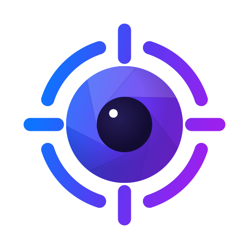

# TailCam

**Every webcam you own. One private dashboard. Anywhere.**

TailCam turns any Linux, macOS, or Windows machine with a webcam into a private,
AI-powered camera system you can watch from anywhere over
[Tailscale](https://tailscale.com) — no cloud, no accounts, no subscriptions, no
port forwarding.

[](https://github.com/factshin/tailcam)
[](#install-in-60-seconds)
[](pyproject.toml)
[](#docker)
[](#license)

[Install](#install-in-60-seconds) · [Tour](#a-quick-tour) ·
[Multi-host](#multi-host-every-camera-from-any-device) · [Local AI](#local-ai) ·
[Agents / MCP](#ai-agents-mcp) · [Plugins](#plugins--marketplace) ·
[Security](#security-model) · [Development](#development)

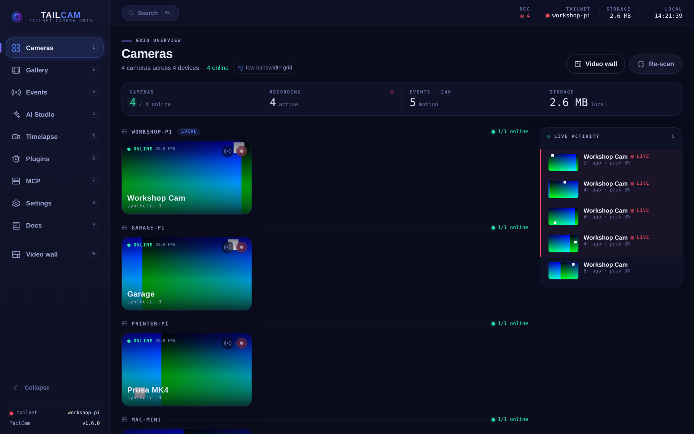

<sub>The dashboard aggregating four cameras across four tailnet devices — live grid, stats, and motion activity feed.
All screenshots on this page are the real app running with TailCam's built-in synthetic demo camera.</sub>

</div>

---

## Why TailCam?

Old webcams are everywhere — in drawers, on shelves, attached to machines that are
already running. TailCam puts them to work as a monitoring system that is genuinely
**yours**:

- **Private by construction** — the server binds to `127.0.0.1` and is only reachable
  over your tailnet. Tailscale's encryption and identity are the security boundary;
  there is nothing to expose to the internet and no vendor in the loop.
- **A real product, not a science project** — a polished installable PWA dashboard,
  desktop tray apps for all three OSes, an optional browser extension, motion
  detection with recording, object detection out of the box, timelapses, a plugin
  marketplace, and an MCP server for AI agents.
- **Fleet-native** — install it on two, three, ten machines; every node discovers the
  others and shows *all* cameras in one dashboard, from any device.
- **Local AI, zero setup** — live bounding boxes and labeled motion events from a
  built-in detector that downloads itself on first use and runs entirely on your
  hardware. Scale up to Ollama vision models, or train your own — still local.

## A quick tour

<table>
  <tr>
    <td width="50%">
      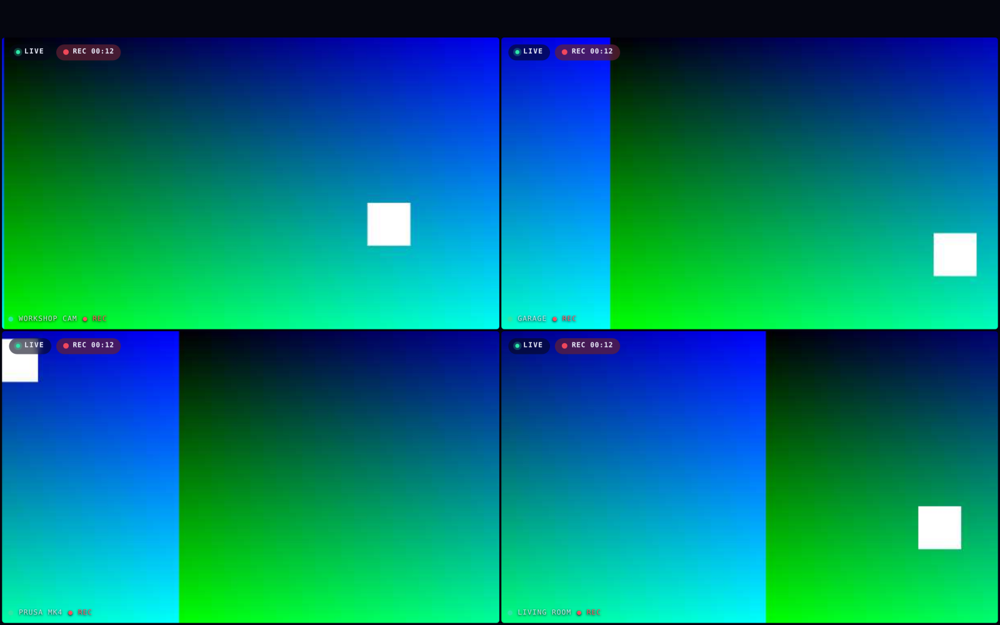
      <br /><b>Video wall</b> — every camera full-bleed on one screen (press <code>W</code>). Low-bandwidth tiles; click any feed for full quality.
    </td>
    <td width="50%">
      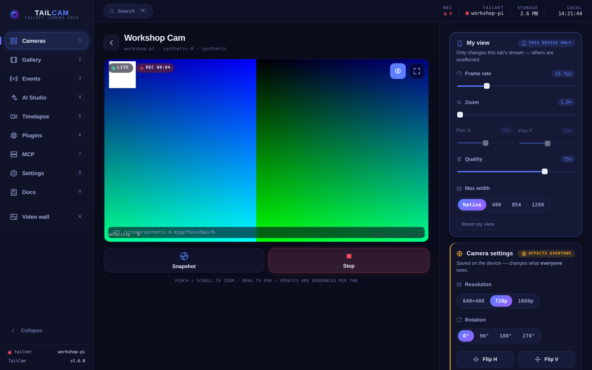
      <br /><b>Camera view</b> — live stream with per-viewer FPS/zoom/pan/quality, plus device-wide resolution, rotation, and flips. Snapshot and record in one tap.
    </td>
  </tr>
  <tr>
    <td width="50%">
      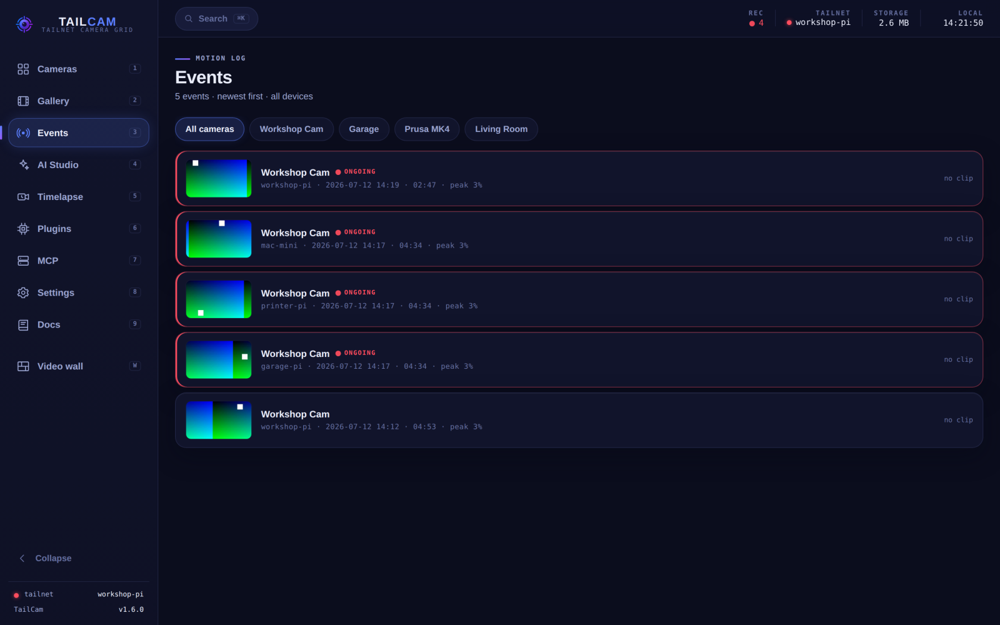
      <br /><b>Events</b> — the motion log across all devices, with per-event clips, thumbnails, and AI labels when enabled.
    </td>
    <td width="50%">
      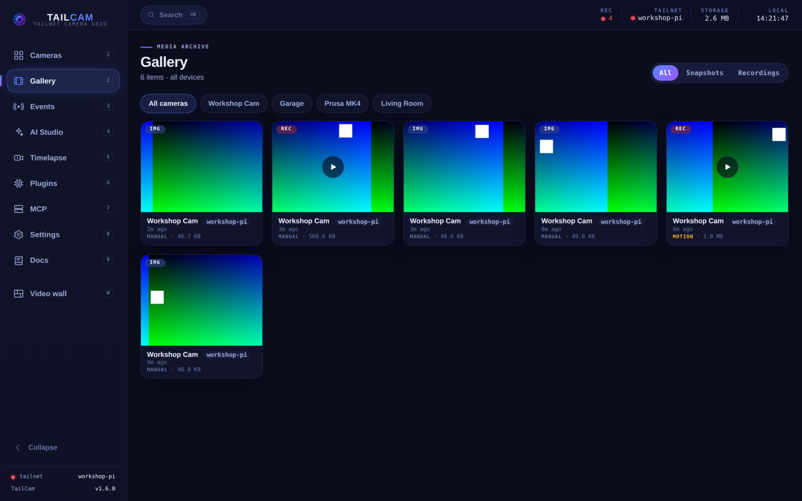
      <br /><b>Gallery</b> — snapshots and recordings from every camera, filterable by device and type.
    </td>
  </tr>
  <tr>
    <td width="50%">
      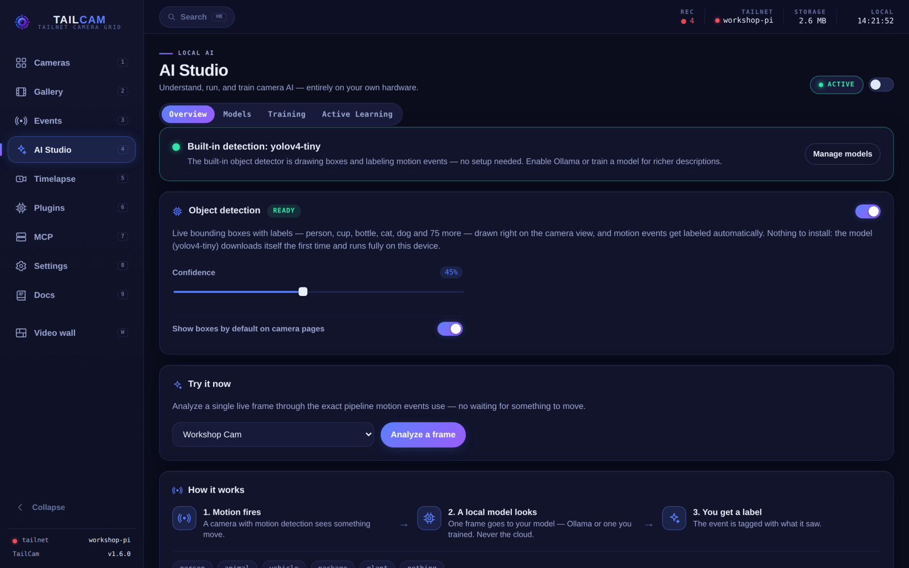
      <br /><b>AI Studio</b> — object detection, Ollama motion analysis, training, and active learning — all local, managed from one place.
    </td>
    <td width="50%">
      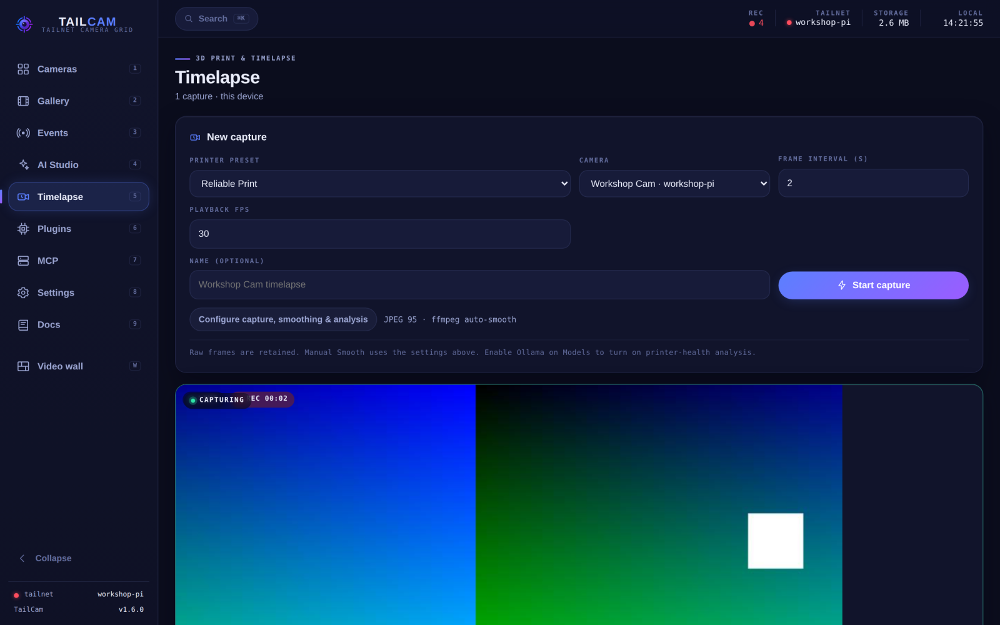
      <br /><b>Timelapse</b> — long captures with printer presets, then “Smooth” them into flowing motion with ffmpeg or GPU RIFE interpolation.
    </td>
  </tr>
  <tr>
    <td width="50%">
      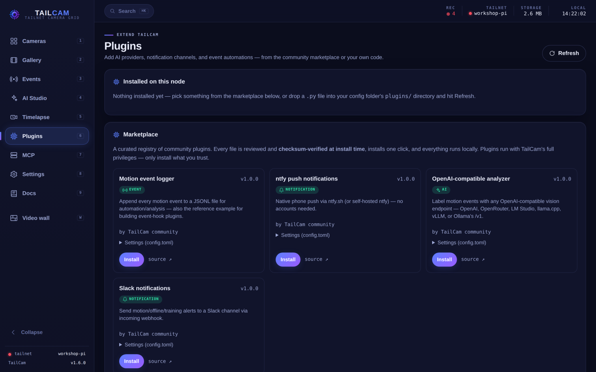
      <br /><b>Plugins</b> — one-click, checksum-verified community plugins: notification channels, AI providers, event automations.
    </td>
    <td width="50%">
      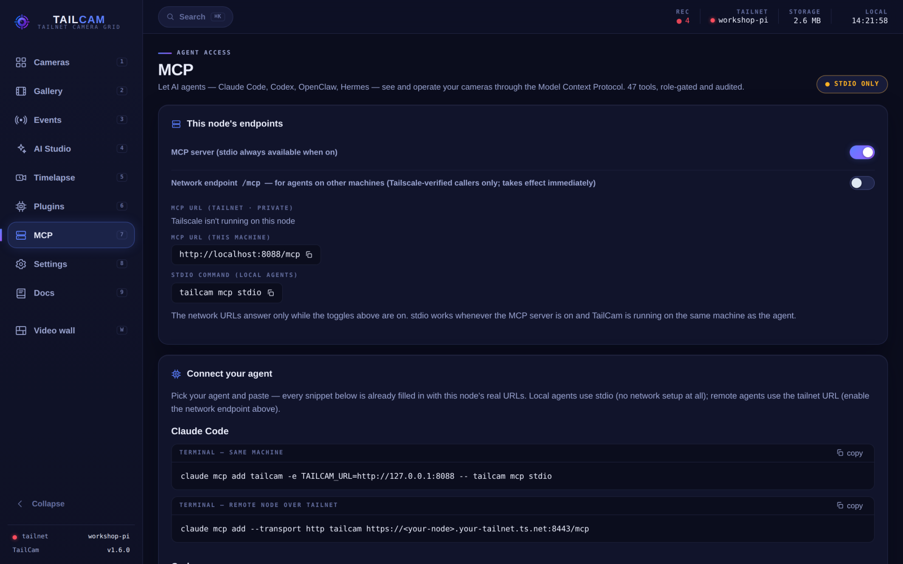
      <br /><b>MCP</b> — connect Claude Code, Codex, or any MCP agent to your cameras with copy-paste snippets. 47 tools, role-gated and audited.
    </td>
  </tr>
  <tr>
    <td width="50%">
      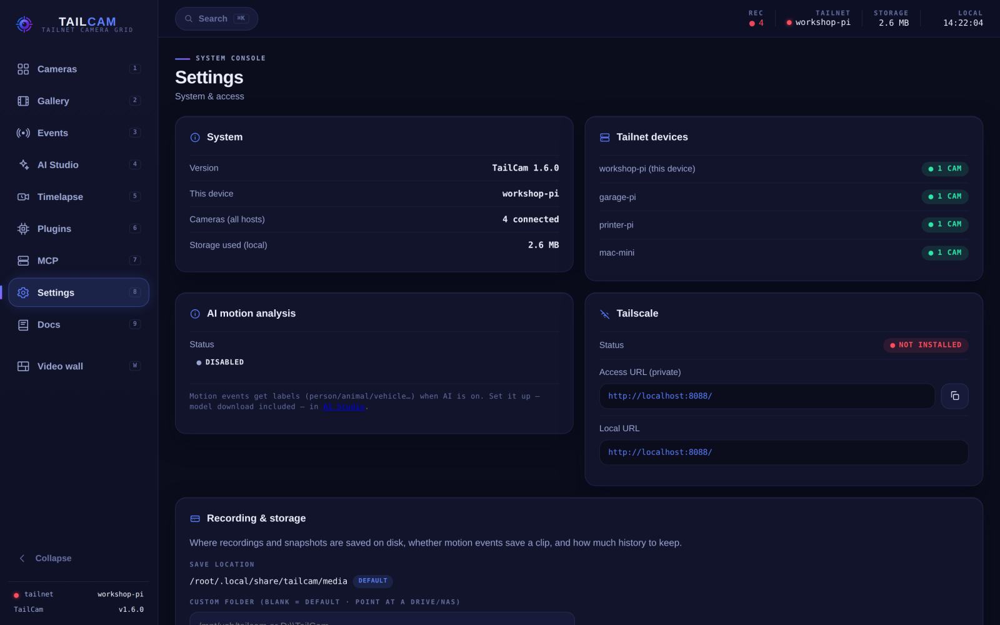
      <br /><b>Settings</b> — system console: fleet devices, Tailscale status, storage and retention, integrations.
    </td>
    <td width="50%">
      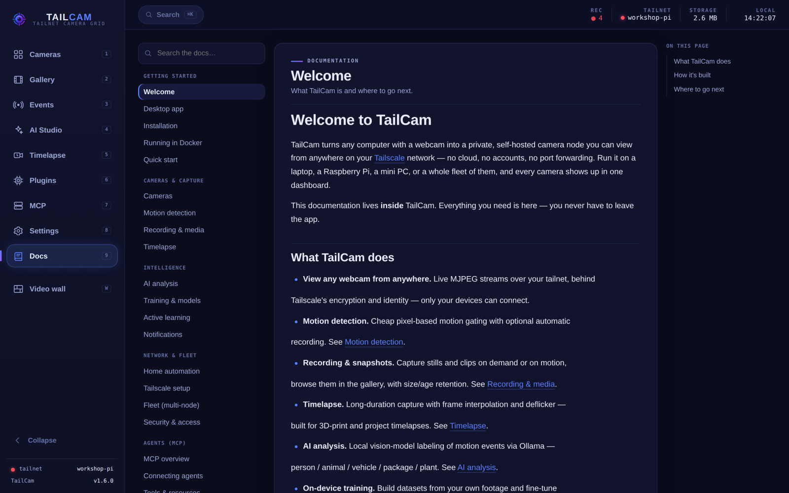
      <br /><b>Docs</b> — the full manual ships inside the app. Everything you need without leaving the dashboard.
    </td>
  </tr>
</table>

<div align="center">
  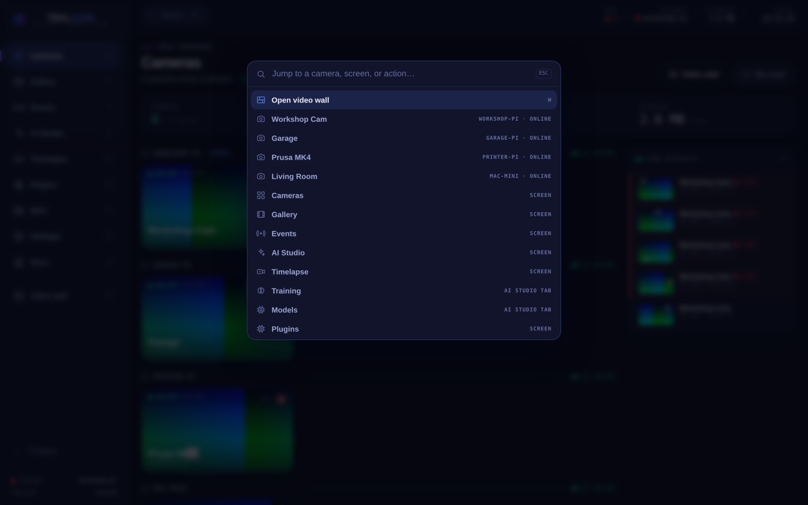
  <br /><sub><b>Command palette</b> — <kbd>Cmd/Ctrl&nbsp;K</kbd> jumps to any camera, screen, or action.</sub>
</div>

## Install in 60 seconds

Pick the one-liner for your OS — each installer is dedicated to that platform (no
cross-OS guesswork).

**Linux** (Debian/Ubuntu/Raspberry Pi OS):

```bash
curl -fsSL https://raw.githubusercontent.com/factshin/tailcam/main/install-linux.sh | bash
```

**macOS:**

```bash
curl -fsSL https://raw.githubusercontent.com/factshin/tailcam/main/install-macos.sh | bash
```

**Windows** (PowerShell):

```powershell
irm https://raw.githubusercontent.com/factshin/tailcam/main/install.ps1 | iex
```

Each installer:

- checks for Python 3.10+ (Linux also installs the system libraries numpy/OpenCV need),
- installs TailCam into an isolated virtualenv,
- registers a background **user** service so TailCam starts automatically —
  systemd `--user` + lingering (Linux), launchd agent (macOS), or a logon
  Scheduled Task (Windows),
- detects Tailscale and, if it's running, exposes the UI over HTTPS with `tailscale serve`.

After install, open the URL printed at the end (your tailnet HTTPS address, or
`http://localhost:8088/` locally).

<details>
<summary><b>Installer options & uninstall</b></summary>

```bash
# Linux / macOS — download then run with flags:
curl -fsSL .../install-linux.sh -o install-linux.sh && bash install-linux.sh --port 9000 --no-tailscale
```

```powershell
# Windows:
irm .../install.ps1 -OutFile install.ps1 ; .\install.ps1 -Port 9000 -NoTailscale
```

Linux/macOS flags: `--port`, `--ref <tag>`, `--no-service`, `--no-tailscale`.
Windows: `-Port`, `-Ref`, `-NoService`, `-NoTailscale`.

To uninstall: run `uninstall-linux.sh` / `uninstall-macos.sh` / `uninstall.ps1`, or
`tailcam uninstall-service` to just remove the background service.

</details>

<details>
<summary><b>Windows notes (ARM64, service model, camera names)</b></summary>

**Windows on ARM** (Surface Laptop 7 / Snapdragon X, and other ARM64 PCs): the
installer automatically uses **x64 Python**, which Windows 11 runs
transparently under emulation — TailCam's camera stack (OpenCV) publishes no
native ARM64 wheels yet, so native ARM64 Python cannot install it. Windows 11
is required on ARM (Windows 10 on ARM can't emulate x64). Every install writes
a full log to `%LOCALAPPDATA%\TailCam\install-<timestamp>.log`; if something
fails, the window stays open and points you at that file.

The logon Scheduled Task runs TailCam in your user session (so the webcam is
accessible) and starts after you log in — the same "user session" model as the
Mac/Linux services. Camera names need the optional `pygrabber` package
(installed automatically); without it cameras show as "Camera 0/1…".

</details>

<details>
<summary><b>Manual install (pipx / pip)</b></summary>

```bash
pipx install git+https://github.com/factshin/tailcam.git
# or
python3 -m venv .venv && .venv/bin/pip install git+https://github.com/factshin/tailcam.git
tailcam run
```

</details>

### Docker

Run TailCam fully isolated in a container. The image bundles TailCam, the
dashboard, Tailscale, and the OpenCV/ffmpeg libraries.

**One-liner** (Linux host with Docker) — pulls the prebuilt image and runs it:

```bash
# local-only (open http://localhost:8088/)
curl -fsSL https://raw.githubusercontent.com/factshin/tailcam/main/install-docker.sh | bash

# join your tailnet and serve over Tailscale
curl -fsSL https://raw.githubusercontent.com/factshin/tailcam/main/install-docker.sh | bash -s -- --authkey tskey-auth-xxxx
```

**Prebuilt image** (multi-arch — amd64 + arm64/Raspberry Pi):

```bash
docker pull ghcr.io/factshin/tailcam:latest
```

**Docker Compose** (from a repo checkout):

```bash
# local-only — reach it on the host at http://localhost:8088/
docker compose up -d

# or join your tailnet and serve over Tailscale
TS_AUTHKEY=tskey-auth-xxxx docker compose up -d
```

With `TS_AUTHKEY` set, the container starts `tailscaled`, joins your tailnet as
`tailcam`, and serves at `https://tailcam.<tailnet>.ts.net:8443/` — the same
experience as a native install, plus full verified-admin access. Without it,
TailCam runs local-only on the published port.

Pass a webcam with `--device /dev/video0:/dev/video0` (**Linux hosts only** —
Docker Desktop on macOS/Windows can't see host USB cameras; use a native install
there, or `TAILCAM_SYNTHETIC=1` to test). Data, config, and Tailscale identity
persist in named volumes. Build directly with `docker build -t tailcam .`.

Full details — networking modes, persistence, env vars, and troubleshooting — are
in the in-app **Docs → Running in Docker** page (also served at `/docs/docker`).

## Feature highlights

- **Polished dashboard (PWA)** — a responsive React web app (installable on phone or
  desktop) with a live camera grid grouped by device, a video wall, a command palette
  (Cmd/Ctrl+K), a mobile-first camera view with pinch/zoom, gallery, and motion
  events. Built and shipped inside the package; see [`web-ui/`](web-ui/).
- **Desktop app (macOS, Linux, Windows)** — a menu-bar/tray app with the dashboard in
  its own window, service controls, fleet-node switching, and one-click updates
  (`tailcam app`) on all three platforms.
- **Browser extension (optional)** — *TailCam Companion* for Chrome, Edge, Firefox,
  and Safari; see [below](#browser-extension-optional).
- **Multi-host aggregation** — see every camera across all your tailnet devices from
  any one of them.
- **Multi-camera** — auto-detects connected webcams; name them and view them in a grid.
- **Resolution, zoom & pan** — set capture resolution; per-viewer digital zoom + pan;
  rotate/flip; brightness/contrast/FPS controls.
- **Snapshots & recording** — capture stills and record clips to disk, with a gallery.
- **Motion detection** — detect motion, log events, and save a clip per event (on by
  default).
- **Object detection** — built-in live bounding boxes + labels (80 COCO classes), zero
  setup, auto-downloading local model; upgrades itself to Ultralytics YOLO11 when
  torch is installed.
- **Timelapse + smoothing** — capture a timelapse (great for 3D prints), then "Smooth"
  it into flowing motion with a bundled **ffmpeg** engine or an optional GPU **RIFE**
  model (`rife-ncnn-vulkan`), with automatic fallback.
- **Train your own model** — collect and label footage from your own cameras and
  fine-tune a private model on your Mac/Windows GPU (optional `tailcam[training]`
  extra) — classification or object detection, with in-dashboard box drawing.
- **Active learning (human-in-the-loop)** — auto-label confident detections, send
  only uncertain frames to **Label Studio**, and fine-tune YOLO, Florence-2, or
  Qwen2.5-VL from the synced annotations.
- **Plugin marketplace** — one-click, checksum-verified community plugins (AI
  providers, notification channels, event automations); write your own with a single
  Python file.
- **MCP server** — agents (Claude, Codex, …) can inspect cameras, events, and health
  and run guarded admin workflows; see [`docs/mcp.md`](docs/mcp.md).
- **Tailscale-native** — secure access over your tailnet; fully usable on a LAN too.

## Multi-host: every camera, from any device

Install TailCam on more than one machine on the same tailnet (a Raspberry Pi, a Mac, a Linux
box…) and **each node automatically discovers the others and shows all of their cameras**. Open
the dashboard on any device and you see every camera across your tailnet in one place — no matter
which machine the webcam is physically plugged into.

How it works:

- The node you're viewing becomes an **aggregator**: it finds the other TailCam nodes, asks each
  for its camera list, merges them, and **reverse-proxies** the remote video and controls — so
  your browser only ever talks to the node you opened (one origin, one Tailscale cert).
- **Discovery is automatic** over Tailscale (it probes online tailnet peers for a running TailCam).
  You can also list peers explicitly:

  ```toml
  # ~/.config/tailcam/config.toml
  [peers]
  auto_discover = true
  static = ["https://tailcam-pi.your-tailnet.ts.net:8443"]   # optional explicit peers
  ```

- Name a node with `TAILCAM_HOST` (otherwise its Tailscale MagicDNS name / hostname is used), e.g.
  `TAILCAM_HOST=garage-pi`.
- `GET /api/hosts` lists every node (local + peers) and their camera counts.

Notes & current limits:

- Remote cameras are fully viewable **and** controllable (resolution, zoom/pan, snapshot, record).
- This treats every TailCam node on your tailnet as trusted — the intended model for a personal
  tailnet (there is no separate auth; Tailscale is the security boundary).
- For now, the **gallery and motion-event feed are per-host** (snapshots/recordings live on the
  node that captured them). Cross-host media aggregation is planned next.
- Linux, macOS, **and Windows** nodes all participate in the same tailnet dashboard.

## Local AI

### Object detection — built in, zero setup

Open any camera and TailCam draws **live bounding boxes with labels** — person,
cup, bottle, cat, dog, and the rest of the 80 COCO classes — using a built-in
detector that's **on by default** and runs entirely on your hardware. The model
(a few MB of YOLO) downloads itself the first time it's needed; nothing to
install or configure. Motion events are labeled from the same detector, so the
Events page gets PERSON / DOG / CUP chips out of the box. Tune it (confidence,
class filter, engine, bigger models) in **AI Studio → Object detection** or the
`[detection]` config section.

### AI motion analysis — local, optional

Motion detection is free pixel-diff; when it fires, TailCam can ask a **local
[Ollama](https://ollama.com) vision model** to label the event (person / animal /
vehicle / package / …) with a short description — no cloud. Because cheap motion
*gates* the model, it's only consulted a frame or two per event, so one machine
can analyze the whole fleet.

Set up (e.g. on a Mac mini):

```bash
# Install Ollama and pull a vision model (moondream is small + fast):
ollama pull moondream          # or: qwen2.5vl / llava for better labels
```

Then enable it from the dashboard: open **AI Studio → Models**, flip **Motion AI
(Ollama)** on, set the model and the Ollama URL (`http://localhost:11434`, or a
tailnet host like `http://mac-mini.your-tailnet.ts.net:11434` to analyze the
whole fleet), and hit **Save & test** — no restart, no config file. The panel
shows whether Ollama is reachable and the model is pulled. (You can still set
`[ai]` in `config.toml` if you prefer.)

Motion events then show a label chip (🧍 person, 🚗 vehicle…) + the trigger
thumbnail. To let one node analyze another's events, point the URL at that node
(and run Ollama with `OLLAMA_HOST=0.0.0.0` so the tailnet can reach it). See
[`docs/ai-detection-plan.md`](docs/ai-detection-plan.md) for the roadmap
(notifications, 3D-print failure detection).

### Train your own — and let the loop label for you

Collect and label footage from your own cameras, then fine-tune a private model on
your Mac/Windows GPU (optional `tailcam[training]` extra). Build either a
**classification** model (one label per frame) or an **object-detection** model —
draw bounding boxes (where *and* what) right in the dashboard, train a YOLO
detector, and overlay live boxes on any camera.

With **active learning**, a labeling model (built-in YOLO, your trained model,
Ollama, **Florence-2**, or **Qwen2.5-VL**) watches your cameras, auto-labels
confident detections, and sends only the *uncertain* frames to **Label Studio**
for you to review; synced annotations fine-tune YOLO, Florence-2, or Qwen2.5-VL
(via Unsloth, CUDA). One click in **AI Studio → Active Learning**; see the in-app
**Docs → Active learning** page.

## AI agents (MCP)

TailCam ships an MCP server, so agents like Claude Code and Codex can inspect
cameras, events, and node health — and run guarded admin workflows — over
`tailcam mcp stdio` or the authenticated `/mcp` HTTP mount. The **MCP** page in
the dashboard generates ready-to-paste connection snippets for each agent. See
[`docs/mcp.md`](docs/mcp.md) and [`docs/mcp-security.md`](docs/mcp-security.md).

## Plugins & marketplace

TailCam is extensible: **AI providers, notification channels, and motion-event
automations are plugins**. Open **Plugins** in the nav to browse the curated
marketplace — Slack and ntfy.sh alerts, an OpenAI-compatible analyzer (LM
Studio / llama.cpp / OpenRouter / OpenAI), a motion-event logger — and install
with one click. Every marketplace file is reviewed and **sha256-verified at
install time**, installs hot-load without a restart, and everything runs
locally.

Building your own is one Python file with one import
(`tailcam.plugins.sdk`) — see the in-app **Docs → Plugins** authoring guide and
[`marketplace/`](marketplace/) for the template + contribution process.
Community plugins land in the registry via reviewed pull requests.

## Browser extension (optional)

**TailCam Companion** brings the dashboard into your browser chrome — strictly an
enhancement, never a requirement. One shared WebExtension codebase ships for
**Chrome, Edge, Firefox, and Safari** (Manifest V3, no frameworks, no third-party
servers, no analytics):

- **Toolbar mini-dashboard** — live camera thumbnails across all your nodes, one-tap
  snapshot/record, and the latest motion events with their AI label chips.
- **Badge + notifications** — unseen-event count on the toolbar icon; native
  notifications filterable to *labeled-only* or *person-only*, with quiet hours.
- **Glance window** — pop any camera into a small floating viewer and keep working.
- **Omnibox** — type `tc <camera name>` in the address bar to jump straight to it.
- **Keyboard shortcuts** — open the dashboard or glance your pinned camera.

The extension talks directly to the nodes you configure (over your tailnet), and
host permission is requested per node at runtime. Source, build script, and
per-browser install instructions live in
[`browser-extensions/`](browser-extensions/).

## CLI

| Command | Description |
| --- | --- |
| `tailcam run` | Start the web server |
| `tailcam status` | Cameras + tailnet nodes (Rich table) and the access URL |
| `tailcam doctor` | Diagnostics: Python, OpenCV, cameras, Tailscale, fleet reachability |
| `tailcam cameras` | List detected cameras |
| `tailcam update [--check]` | Update to the latest version (and restart the service) |
| `tailcam start` / `stop` / `restart` | Control the background service |
| `tailcam install-service` / `uninstall-service` | Register/remove the background service |
| `tailcam tailscale serve` / `serve-off` / `status` | Manage tailnet exposure |
| `tailcam config [--init] [--port N] [--serve-port N] [--host H]` | Show or update config |
| `tailcam mcp stdio` | Run the MCP server for local agents |
| `tailcam app` | Launch the desktop app |

Tab-completion: `tailcam --install-completion`. `tailcam --version` prints the version.

## Ports & Tailscale

There are two separate ports:

- **`server.port`** (default **8088**) — the local web UI: `http://localhost:8088/`.
- **`tailscale.serve_port`** (default **8443**) — the tailnet-facing HTTPS port.

TailCam serves on **`https://<host>.<tailnet>.ts.net:8443/`** by default rather than the
root (`:443`), so it won't clobber another app (e.g. OpenClaw) already served at the root
URL. Tailscale permits `443`, `8443`, and `10000` for serve/funnel.

To change the tailnet port:

```bash
tailcam tailscale serve --https-port 10000   # one-off + saved to config
# or edit ~/.config/tailcam/config.toml  ([tailscale] serve_port = 10000) and restart the service
```

If TailCam previously grabbed the root URL and you want it back for another app:

```bash
tailcam tailscale serve-off --https-port 443   # removes only TailCam's :443 handler
```

## Security model

TailCam's boundary is your **Tailscale network**: the server binds to `127.0.0.1` and is reached
over your tailnet, with no per-request login. On top of that, TailCam ships defense-in-depth:

- **Cross-origin / drive-by protection** — state-changing requests (snapshot, record, delete,
  settings) from a foreign web origin are rejected; only localhost and your tailnet (`*.ts.net`)
  may mutate. This stops a malicious site you visit from poking your local TailCam (CSRF / DNS
  rebinding).
- **Security headers** on every response — `Content-Security-Policy` (same-origin only),
  `X-Frame-Options`, `X-Content-Type-Options: nosniff`, `Referrer-Policy`, `Permissions-Policy`.
- **No SSRF amplification** — the peer reverse-proxy does not follow redirects.
- **Anti-DNS-rebinding** — state-changing requests are accepted only when the `Host` is
  loopback, an IP literal, or your tailnet (`*.ts.net`); a rebound attacker hostname is rejected.
- **Secrets** (MQTT password, HomeKit pin, Tailscale keys) live in `config.toml`, written
  `0600` in cleartext — secure your backups and support bundles accordingly.
- No accounts, tokens, telemetry, or third-party calls (except checking GitHub for updates).

Keep the default `127.0.0.1` bind — don't expose TailCam directly to a public network; let
Tailscale handle access.

## Architecture

One capture thread per camera publishes the latest frame into a lock-light
`FrameBuffer`; FastAPI serves an MJPEG stream (`multipart/x-mixed-replace`) with
JPEG encoding offloaded to a thread pool so the event loop never blocks. The
streaming layer sits behind a `StreamBackend` abstraction, so a low-latency
WebRTC backend can be added later without changing capture or the web layer.
Settings live in a TOML config; the camera registry, media index, and motion
events live in SQLite.

## Development

```bash
python3 -m venv .venv && source .venv/bin/activate
pip install -e ".[dev]"
TAILCAM_SYNTHETIC=1 tailcam run    # run without a physical webcam
pytest                             # tests use a synthetic camera, no hardware needed
ruff check . && mypy src
```

Set `TAILCAM_SYNTHETIC=1` to use a built-in synthetic camera source — useful on
headless servers, in containers, and in CI where no webcam exists.

The dashboard front-end lives in [`web-ui/`](web-ui/) (React + Vite). Its build
output is committed to `src/tailcam/web/spa/` and ships in the wheel, so end users
never need Node. To change the UI: `cd web-ui && npm install && npm run build`,
then commit both the source and the regenerated `src/tailcam/web/spa/`.

**Releases:** bump `__version__` in `src/tailcam/__init__.py` **and** the
`version` in `web-ui/package.json` (keep them identical) with every change
merged to `main`; a test enforces they match. The version is shown by `tailcam
version` (and `tailcam --version`), `tailcam status`, `/api/system`, and the
dashboard Settings page — it's how you confirm a node is actually running the
build you think it is.

## License

[Elastic License 2.0 (ELv2)](LICENSE)

---

<div align="center">
<sub>If TailCam puts your old webcams back to work, a ⭐ helps others find it.</sub>
</div>
