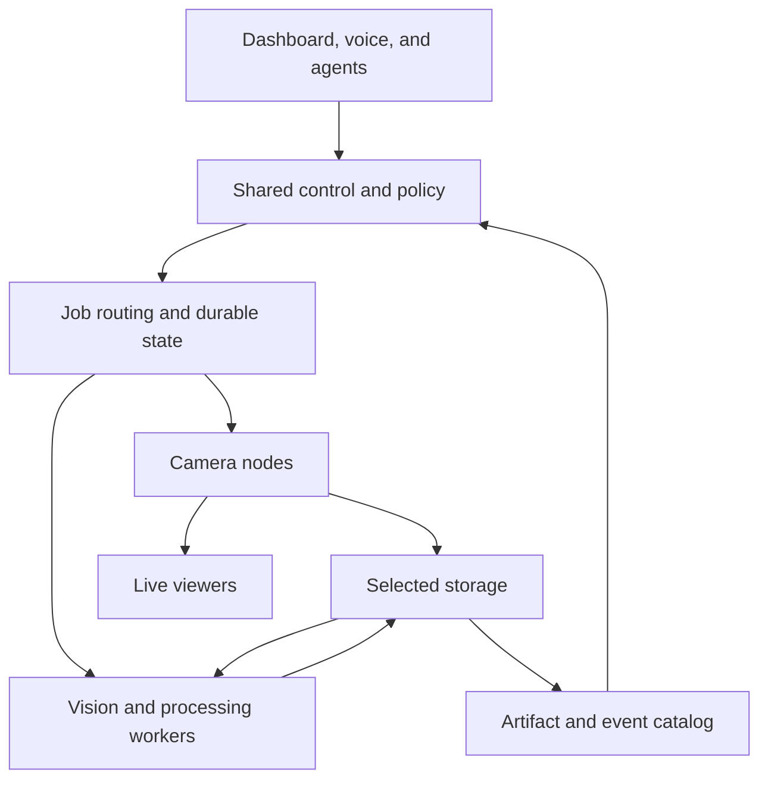

# TailCam: source-of-truth update roadmap and implementation handoff

Prepared for Wayne Scire · 11 September 2026 · Document revision **r3**

**Status:** 1.8.5 implemented and locally validated in [PR #85](https://github.com/FactShin/TailCam/pull/85); no merge or release. **Last verified main baseline:** 1.8.4 at `3f2d5fd3785fd2ee498cf56ac90fee10d5f1f415`. **Authoritative implementation roadmap:** this repository file, imported from the supplied r2 planning snapshot on 2026-09-11. Document revisions and application release versions are separate.

**Purpose:** this file carries the product intent, engineering constraints, release scopes, completion gates, and working instructions into a new session. It consolidates the original feature attachment, architecture review, all nine later product suggestions, and the decision to add agent-supervised training. A fresh agent should not need the original chat to understand the work.

## Start here in a new session

Read this section, the release table, and the selected release's detail before making changes. The architecture findings and test results below describe the reviewed commit; verify them against current code before treating them as current defects or guarantees.

1. **Establish the checkout.** Use `https://github.com/FactShin/TailCam`. Read applicable `AGENTS.md` and repository development instructions. Record branch, full HEAD SHA, working-tree changes, current runtime/dashboard/extension versions, recent releases, and relevant open PRs. Preserve unrelated work. Use an isolated branch/worktree when needed.
2. **Reconcile progress.** Compare current code, merged PRs, and tests with this document's release ledger. Distinguish already shipped, partially implemented, unimplemented, and superseded work. Do not repeat an existing feature or label an old test result as a fresh run.
3. **Choose the next bounded slice.** Start with the earliest unmet dependency. Unless the user directs otherwise, the first slice is reproducing and fixing the 1.8.5 timelapse routing issue. Do not implement the entire roadmap in one branch.
4. **Make a small implementation brief.** State the user's outcome, affected services/interfaces, existing behavior, proposed behavior, migration needs, acceptance checks, and expected version bump. Resolve ordinary implementation choices from this document and repository evidence. Ask only when a missing decision materially changes scope or introduces an irreversible action.
5. **Implement vertically.** Complete the service/API behavior, persistence, UI or MCP path, documentation, and relevant tests together. Keep existing single-machine operation and optional-dependency behavior working.
6. **Validate with evidence.** Run targeted regression tests for the changed behavior; satisfy current repository CI gates. Use separate processes and independent media roots for fleet/storage tests. Run platform/hardware checks when the release claims depend on them, or record them as outstanding and do not claim the release is ready.
7. **Prepare the release coherently.** Update version-bearing files, release notes, affected in-app docs, and the dashboard bundle when frontend source changes. Confirm exact artifact/source correspondence. Proposed version numbers below must be rebased if other releases have shipped; never reuse a published version or downgrade an installation to fit this plan.
8. **Leave a durable checkpoint.** Update the ledger and handoff record below with commit/PR, completed scope, checks/results, outstanding risks, and the exact next action. Preserve a single authoritative roadmap rather than divergent copies.

This document is planning guidance, not authorization to train on private footage, delete data, activate a model, merge a PR, or publish a release. Follow the current user's task authorization and applicable environment/repository rules. Preparation and reversible implementation should continue without unnecessary permission requests once authorized.

**Authority order:** current user decisions and applicable system/repository instructions govern work; current code and tests establish implementation facts; this roadmap establishes intended product direction. If they conflict, document the discrepancy and update the plan rather than making the code match a stale assumption.

**Suggested future repository location:** `docs/update-roadmap.md`. This review has not added or committed it to GitHub. When repository implementation is authorized, include the reconciled roadmap in the first relevant PR and maintain it alongside subsequent changes. If maintained in both a downloadable file and the repository, record the matching document revision and commit; do not silently let them diverge.

### Copyable session-start prompt

```text
Read the attached TailCam source-of-truth update roadmap in full. Use
https://github.com/FactShin/TailCam and follow its applicable development instructions.

First reconcile the roadmap against the current branch, version, recent releases,
and open/merged work. Do not assume the reviewed 1.8.4 baseline is still current.

Implement the earliest incomplete, dependency-ready release slice unless I name
another one. Keep the work bounded and preserve unrelated changes. Include the
necessary backend, UI/MCP, migration, documentation, version, and test changes.
Use the roadmap's acceptance criteria; distinguish verified results from checks
that still require my hardware. Prepare a reviewable branch/PR where available.
Follow this session's authorization for merge, publishing, data changes, and model
activation; this document does not grant those actions by itself.

Update the roadmap's progress ledger and session handoff before stopping. Tell me
what changed, what passed, what remains, and the exact next action.
```

### Decisions to preserve

| Decision | Meaning for implementation |
|---|---|
| Local-first operation | No mandatory paid model key or cloud processing; provisioned local workflows remain usable offline |
| Camera capture stays lightweight | Heavy AI, rendering, and training are optional and separately placeable; protect low-memory nodes |
| All user-created content has a chosen home | Route artifacts consistently; make minimal local runtime state and any buffering explicit |
| Manual control remains authoritative | Automatic placement and optimization respect selected nodes, budgets, and fallback policies |
| One control system | Dashboard, CLI, MCP, voice, and automation share validated service operations and policy enforcement |
| Agent-supervised training is in scope | First useful supervisor in 1.11; deeper MCP controls in 1.14; evaluation/promotion gates in 1.16 |
| Model deployment is distinct from training | Initial supervisor recommends a candidate; automatic promotion is disabled until explicit policy and evaluation support exist |
| Preserve existing work | Reuse capture, fleet, training, timelapse, and MCP foundations; avoid wholesale rewrites |
| Version each shipped change | Patches fix compatible defects; minors add compatible capabilities; majors require deliberate compatibility breaks |
| All nine product suggestions are included | Each has a named delivery milestone and acceptance gate; ship them in bounded slices |


**Recommendation:** evolve TailCam into a private camera and automation system where each machine has an explicit job, every saved artifact has a known home, and AI agents and voice use the same dependable controls as the dashboard.

The first priority is fixing the existing storage/analysis behavior. The next is a shared foundation for device roles, storage placement, and workload routing. Voice becomes much more useful once that foundation can reliably answer, “What happened, where is the evidence, and what can I do about it?”

## Review basis and limits

Reviewed repository: [FactShin/TailCam](https://github.com/FactShin/TailCam), default branch `main`, commit [`3f2d5fd3785fd2ee498cf56ac90fee10d5f1f415`](https://github.com/FactShin/TailCam/commit/3f2d5fd3785fd2ee498cf56ac90fee10d5f1f415), dated 9 September 2026. Runtime and dashboard version: **1.8.4**. GitHub's releases collection and the remote tag listing were empty when checked; 1.8.4 is the verified code version, not a claim about every distribution channel or your installed machines.

The repository inventory contains 381 tracked files, including 124 Python files under `src/tailcam` (22,922 lines), 41 TypeScript/TSX files under `web-ui/src` (9,672 lines), and 46 Python test files (8,321 lines). Review covered the subsystem interfaces and traced the critical capture, storage, timelapse, inference, fleet, settings, security, MCP, installation, and update paths. Supporting training, integrations, desktop, extensions, packaging, and test infrastructure informed the roadmap.

Your attached “TailCam features” webarchive supplied all seven starting ideas. Items below distinguish shipped functionality, source-supported gaps, proposed features, and hardware validation still required. This is an architecture and implementation-planning review, not a claim that every execution path has been proven correct. No repository changes, issues, releases, or pull requests were created.

## 1. What TailCam already is

| Area | Current implementation | Architectural implication |
|---|---|---|
| Application | Python 3.10+ package; Typer CLI; FastAPI; `AppContext` wires services together | Keep one installable application with optional worker processes rather than introducing mandatory infrastructure services |
| Camera capture | Platform-specific enumeration and OpenCV capture; one worker per camera; queued device-property changes | Preserve exclusive ownership of each capture device |
| Frame delivery | Latest-only `FrameBuffer`; consumers follow replacement buffers across restarts | Slow AI or clients need not stall capture; live frames are deliberately lossy |
| Streaming | MJPEG with frame/transform/quality cache, separate stream thread limiter; visibility-aware viewer | There are meaningful optimizations already; the `StreamBackend` seam can support future transports |
| Recording | Raw frames piped into ffmpeg/libx264, with OpenCV fallback; frame-rate normalization | Recording still involves decode/encode work; a lightweight source node benefits from offload |
| Motion | Small-frame pixel detection, event thumbnails, asynchronous enrichment, clip triggering, notification filtering | Add zones, temporal reasoning, and bounded background queues on top of this pipeline |
| Fleet | Tailscale/static peer discovery, local-only aggregation, generic proxy, versioned management relay | Fleet viewing exists; a durable fleet control system does not yet exist |
| Storage | Configurable local media folder plus a remote node for recordings/timelapses; destination pulls MJPEG | Remote storage currently also determines capture/encoding execution location |
| Timelapse | Raw JPEG capture, persisted session settings, encoding, deflicker, interpolation, optional RIFE, printer-analysis evidence | Extend this substantial implementation instead of starting a second timelapse engine |
| AI | Built-in detector, Ollama analyzer, remote detector, trained/BYO classifier/detector | Several task-specific paths need one routing and capability contract |
| Training | Datasets, annotation editor, YOLO classification/detection training, model registry, activation | Existing machinery can support measured model improvement and remote training |
| Active learning | Multiple labeling backends, Label Studio review/sync, Florence/Qwen training adapters | Keep human-reviewed labels and evaluation separate from automated confidence claims |
| MCP | **47 tools**, seven static resources, three resource templates, six prompts; stdio and HTTP transports | Extend an existing agent interface; do not build a separate privileged agent control plane |
| Security | Localhost/Tailscale trust model, origin/host defenses, management/MCP roles and audit | Agent scope must eventually be enforced beneath every transport, including legacy REST/proxy paths |
| Integrations | Home Assistant camera/MQTT helpers, HomeKit bridge, notification channels, pluggy marketplace | Use Home Assistant for broad home-device control while TailCam supplies camera evidence and actions |
| Interfaces | React/PWA dashboard, legacy HTML fallback, desktop shell/client mode, four browser-extension manifests | Keep release and compatibility behavior consistent across all interfaces |
| Shipping | OS installers, Docker, PyPI workflow, Linux/Windows tests and desktop platform workflows | Improve release reproducibility and installer behavior together |

Sources: [application wiring](https://github.com/FactShin/TailCam/blob/3f2d5fd3785fd2ee498cf56ac90fee10d5f1f415/src/tailcam/web/context.py), [capture/frame contract](https://github.com/FactShin/TailCam/blob/3f2d5fd3785fd2ee498cf56ac90fee10d5f1f415/src/tailcam/camera/frame.py), [streaming](https://github.com/FactShin/TailCam/blob/3f2d5fd3785fd2ee498cf56ac90fee10d5f1f415/src/tailcam/streaming/mjpeg.py), [MCP registry](https://github.com/FactShin/TailCam/blob/3f2d5fd3785fd2ee498cf56ac90fee10d5f1f415/src/tailcam/mcp/tools.py).

## 2. Findings that change the plan

**A. The selected storage node can be bypassed after a timelapse error.**

`CaptureRouter.start_timelapse()` attempts the remote request and then starts locally unless it received a successful response containing an ID. This includes a remote rejection such as HTTP 409. The recording path already distinguishes several error types more carefully. Consequently, a remote analysis configuration error can turn into a local timelapse. This is a source-supported explanation for your report; your machines and logs were not available to establish which failure occurred there.

**B. Printer analysis and ordinary detection do not share routing.**

`PrinterAnalyzer` directly uses `AIConfig.base_url` and Ollama's generation API. That URL can point to another computer, so remote printer analysis is technically possible. But selecting `detection.node` does not select the printer analyzer. A remotely stored timelapse uses the storage node's analyzer configuration. The remote-start endpoint checks that node's analyzer is enabled. The dashboard's timelapse checkbox instead uses the dashboard node's `useAi()` result. This combination can disable a valid remote configuration or approve a request that the execution node rejects.

**C. “Save everything there” is broader than current storage routing.**

Snapshots and motion thumbnails remain local. Training datasets and managed models live under the local data directory, separately from the configurable media root. Each node has its own SQLite catalog. Existing recordings and timelapses retain their original paths when a new folder is selected; selecting a folder does not migrate old data. The UI explicitly says snapshots stay local, but the overall experience does not fulfill your intended all-data destination.

**D. Storage and processing are currently coupled.**

The selected storage machine pulls the video and runs the recorder/timelapse service. There is no general way to choose storage on machine A, smoothing on B, printer analysis on C, and speech on D. A separate job/result contract is required.

**E. Remote identities need strengthening.**

Peer keys derive from shortened hostnames; catalogs use node-local integer IDs. The UI handles many cross-node cases using host/proxy prefixes, but motion events retain only `recording_id`: `MotionWorker` discards the host carried by a remote recording result. That leaves the event-to-recording relationship unable to uniquely identify an artifact elsewhere. Use stable node IDs and globally qualified artifact references while retaining aliases for old links.

**F. Role presets cannot be only labels in Settings.**

A zero-camera process can already run, and the desktop shell already has client mode. However, `AppContext` still constructs the common service set, starts camera discovery, and creates the timelapse-analysis worker. `NodeCapabilityService` advertises a fixed capability set. Real role selection needs service lifecycle changes, dynamic capability reporting, and hardware/permission checks.

**G. Bigger agent access requires shared authorization.**

MCP tools have role checks and confirmation parameters; management endpoints have role checks too. Many ordinary REST operations rely on network/origin defenses, and the generic proxy exposes ordinary peer operations. Adding narrow MCP permissions alone cannot create narrow application permissions. Also, a model supplying `confirm=true` is not independent proof that a person approved the action. Bind sensitive approvals to a server-held plan or an existing user policy, with expiry and scope.

**H. Voice needs a new audio path.**

There is no local speech pipeline in the reviewed code. The current `Permissions-Policy` explicitly disables microphone access. Voice work therefore includes microphone permission handling, audio transport, cancellation, and output playback—not just selecting a model.

**I. Reliability work should replace ad hoc background execution.**

Motion enrichment and notifications launch daemon threads; timelapse encoding/smoothing and training maintain local execution state. Timelapse analysis already coalesces pending frames, which is worth preserving. Add bounded execution and persistent job state for durable work rather than turning every activity into an unlimited queue.

**J. Release infrastructure exists, but “latest” follows development.**

The updater reads and installs `main`; Docker marks main builds as `latest`. Python tests and linters already run in CI, so “add CI” is the wrong recommendation. The missing improvements are pinned release inputs, distribution consistency, explicit preview channels, dashboard build/typecheck gates, and multi-process failure tests.

Sources: [capture routing](https://github.com/FactShin/TailCam/blob/3f2d5fd3785fd2ee498cf56ac90fee10d5f1f415/src/tailcam/media/capture_router.py), [remote start checks](https://github.com/FactShin/TailCam/blob/3f2d5fd3785fd2ee498cf56ac90fee10d5f1f415/src/tailcam/web/routes_remote.py), [printer analyzer](https://github.com/FactShin/TailCam/blob/3f2d5fd3785fd2ee498cf56ac90fee10d5f1f415/src/tailcam/timelapse/analyzer.py), [timelapse screen](https://github.com/FactShin/TailCam/blob/3f2d5fd3785fd2ee498cf56ac90fee10d5f1f415/web-ui/src/screens/Timelapse.tsx), [paths](https://github.com/FactShin/TailCam/blob/3f2d5fd3785fd2ee498cf56ac90fee10d5f1f415/src/tailcam/paths.py), [motion worker](https://github.com/FactShin/TailCam/blob/3f2d5fd3785fd2ee498cf56ac90fee10d5f1f415/src/tailcam/motion/worker.py), [capabilities](https://github.com/FactShin/TailCam/blob/3f2d5fd3785fd2ee498cf56ac90fee10d5f1f415/src/tailcam/management/capabilities.py), [security middleware](https://github.com/FactShin/TailCam/blob/3f2d5fd3785fd2ee498cf56ac90fee10d5f1f415/src/tailcam/web/security.py), [proxy](https://github.com/FactShin/TailCam/blob/3f2d5fd3785fd2ee498cf56ac90fee10d5f1f415/src/tailcam/web/routes_proxy.py), [updater](https://github.com/FactShin/TailCam/blob/3f2d5fd3785fd2ee498cf56ac90fee10d5f1f415/src/tailcam/update.py).

## 3. The target architecture

Treat every machine as a **node**. A node can perform several roles. “Hub” means the optional preferred coordinator/dashboard; it does not imply storage or AI unless those roles are selected too.

| Role | Responsibility | Important constraint |
|---|---|---|
| Camera | Capture attached cameras and publish frames | Capture continues when other services are slow |
| Hub | Fleet catalog, routing policy, dashboard, job coordination | Standalone operation remains supported; no required cloud control plane |
| Storage | Commit and serve media, evidence, datasets, and managed artifacts | Confirm bytes/checksum before reporting a transfer complete |
| Vision | Detection, event descriptions, printer analysis | Task-specific models and explicit resource limits |
| Processing | Encoding, interpolation, exports, optional training | Background jobs yield resources to live workloads |
| Voice | Speech recognition, conversation/intent processing, speech synthesis | Each stage can run on a different node |
| Client | View/control a selected node | No capture or model installation required |

Use friendly presets—Camera only, Hub only, Storage server, AI worker, All-in-one, Custom—backed by independent role switches. Five cameras is a capacity configuration, not a separate role.

For a typical arrangement, a Pi captures cameras; a Mac serves the dashboard and storage; a GPU-equipped computer handles vision and interpolation. This is an example topology, not a claim that any particular model fits your hardware without measurement.



The implementation should introduce five reusable contracts:

1. **Node identity and capabilities:** persistent UUID, human name, supported task types, model/runtime availability, free storage, load, software/protocol versions, and last successful health check. Discovery is not authorization; only approved nodes accept work.
2. **Artifact reference:** stable ID, originating camera/node, storage owner, content type, checksum, size, capture time, retention policy, and replication state. Consumers request bytes through the owner; they do not interpret another OS's filesystem paths.
3. **Job record:** ID, task type, immutable parameters/config revision, source/input references, chosen worker, destination, priority, retry budget, lease/heartbeat, progress, cancellation, error, and committed outputs. Retry delivery with idempotent effects; do not promise exactly-once network execution.
4. **Routing policy:** manual pin first, optional automatic placement among approved capable nodes, explicit fallback rules, resource budgets, and a readable explanation of the actual route. Execution endpoints must not recursively dispatch to each other; validate cycles and include hop limits.
5. **Shared action service:** dashboard, CLI, MCP, voice, and integrations call the same validated, authorized, audited operations.

Keep live frames latest-only. Persist recording/transfer/export jobs. Keep SQLite local to each process/node and sync records through APIs; do not share a live SQLite database over SMB/NFS. Start with an embedded job store and optional worker processes. Redis, Kubernetes, and distributed consensus are unnecessary requirements for the first implementation.

## 4. Exact proposed release sequence

These are proposed versions assuming the present 1.8.4 baseline and this order. They are not releases created by this review. A release can contain several related features; each subtask does not need its own version.

| Release | Deliverable | Why this bump | Dependency |
|---|---|---|---|
| **1.8.5** | Fix timelapse routing errors, execution-node checks, and remote artifact references | Compatible bug fixes | Current main |
| **1.9.0** | Device roles, capability discovery, role-aware setup and branded installer | New compatible functionality | 1.8.5 |
| **1.10.0** | Unified storage destinations, transfer recovery, artifact catalog | New storage APIs and controls | Role/identity foundation |
| **1.11.0** | Independent workload placement, durable jobs, and initial MCP Training Supervisor | New routing functionality | Identity + artifact transfer |
| **1.12.0** | Advanced timelapse and printer monitoring | New capture/workflow features | Storage + compute routing |
| **1.13.0** | Granular settings, profiles, camera capabilities, complete UI control pass | New compatible controls | Shared settings/routing contracts |
| **1.14.0** | Expanded MCP operations, training supervision controls, and agent troubleshooting | Additive tools and scoped action policies | Shared action/auth layer |
| **1.15.0** | Local voice assistant with independently placed speech/vision stages | New optional subsystem | Workload routing + authorized actions |
| **1.16.0** | Evidence search, temporal events, automation recipes, training evaluation and controlled model promotion | New intelligence/workflow features | Catalog + settings + AI jobs |
| **1.17.0** | Advanced fleet recovery, capacity controls, efficient transport options | New operational features | Durable jobs + metrics |
| **1.18.0** | Missions, the user-facing Replay Lab, and coordinated household modes | New goal-based workflows | Rules/evaluation + durable jobs + scoped controls |
| **1.19.0** | Scene Memory and teaching through examples | New visual comparison and feedback features | Artifact history + Replay Lab + model evaluation |
| **1.20.0** | Incident stories and the workshop companion | New evidence/project workspaces | Stable cross-node references + bookmarks + optional voice |
| **1.21.0** | Temporary phone cameras with expiring pairing | New capture source | Identity + privacy + storage/mission routing |
| **1.22.0** | Optional experience packs for printers, pets, deliveries, workshops, and plants | New extension contracts and packaged workflows | Mature mission/settings/provider interfaces |
| **2.0.0, only if needed** | Retire incompatible legacy APIs/configuration or require a new node protocol | Explicit compatibility break | A published deprecation and migration window |

Use three-part versions going forward: bug fix `1.10.1`, next feature release `1.11.0`. Version numbers are not decimals: 1.10 follows 1.9. An internal redesign or exciting voice feature alone does not require 2.0. The planned sequence continues through 1.22.0 while existing interfaces remain compatible. Do not insert 2.0.0 merely because this sequence grows. This follows [Semantic Versioning](https://semver.org/).

## 5. Release details and expanded ideas

### 1.8.5 — Make existing promises trustworthy

**Build:** distinguish remote rejection, unreachable service, and ambiguous timeout. Surface the original error; do not convert a rejected timelapse into an apparently successful local capture. Preserve documented connectivity fallback for compatibility, but label the actual destination clearly. Explain unresolved/unknown reachability separately from a successful health check.

Scope AI/postprocessing availability to the node that will execute the job. Show “Camera: Pi · Capture/storage: Mac · Printer analyzer: configured endpoint” before starting. Keep the present Ollama URL path functioning while making it discoverable. Add an additive storage-owner reference to remote event recordings and use it consistently in REST, event investigation, gallery links, and MCP results.

**Code:** `media/capture_router.py`, `web/routes_remote.py`, `web/routes_api.py`, `web/schemas.py`, `motion/worker.py`, persistence models/store, `Timelapse.tsx`, API hooks/types, event consumers.

**Ship when:** the same action opened from either source or destination produces the same result; a rejected remote job creates no local session; a remote event identifies the correct recording even when both nodes have media ID 1. Reproduce the reported failure using source, storage, and AI as separate processes.

### 1.9.0 — Give every machine a purpose, starting during installation

**Expand your roles idea:** multi-role presets, a capacity summary, editable role assignments, and explicit empty states for nodes with no cameras. Switching off capture must stop discovery/worker startup, not merely hide the camera cards. Initialize optional services lazily. Move heavyweight imports behind service boundaries where practical; make a genuinely lean hub/client package a measured follow-up if base OpenCV remains necessary initially.

Persist node UUIDs and advertise enabled/healthy capabilities. Show why a node is unsuitable: missing model, insufficient free space, disabled role, unavailable runtime, or incompatible protocol. Keep camera count and resource capacity separate.

**Expand your installer idea:** a TAILCAM ASCII wordmark, restrained color, genuine phase progress, role selection, sensible hardware suggestions, first-camera preview, and a final card with the actual access URL and “what runs here.” No artificial delays. Use the same setup answers across Linux, macOS, Windows, and Docker.

Support unattended/quiet/no-color modes, logs, reruns that preserve configuration, role-appropriate dependencies, no camera-device mounts for a hub-only container, and useful recovery messages. Preserve existing backup/restore behavior. Start stable artifact pinning and unified release metadata here; do not wait until the end of the roadmap to make installs reproducible.

**Code:** `config.py`, `web/context.py`, `management/capabilities.py`, `hostinfo.py`, `cluster/service.py`, CLI, OS installers, service installer, Docker files, setup/settings screens.

**Ship when:** hub-only starts with no camera scans or model downloads; camera-only starts without optional AI/voice runtimes; rerunning setup preserves media and identities; all-in-one still works without a hub.

### 1.10.0 — “Save it on this computer” becomes a complete storage policy

**Expand your all-data idea:** one default destination for all user-created content, plus optional per-camera/per-content overrides. Cover recordings, snapshots, thumbnails, timelapse frames, original/smoothed videos, analysis evidence, training samples, annotations, managed model outputs, and exports. Store their catalog records at the selected content owner and expose a fleet index.

Retain minimal local runtime state: device identity, configuration, job journal, and explicitly bounded caches. Local secrets should not be copied to every destination. Offer encrypted configuration backups separately. A “zero local media” option must reject/stop work when the destination is unavailable; it cannot promise offline capture too.

Provide three explicit outage policies: destination required; bounded local spool then upload; or an approved secondary storage node. Display “pending transfer,” “committed,” “replicated,” and “failed” separately. No unlimited SD-card buffering. Verify destination mount identity so a detached drive does not silently redirect writes to the boot disk.

Add resumable transfers, checksum verification, temporary-file commit/rename, quotas, reserved free space, and per-artifact deletion policies. Make “move old content” a separate previewable operation: copy, verify, update references, then remove originals according to the chosen policy. Retention must account for raw timelapse frames and related artifacts, not just encoded video.

**Code:** introduce storage/artifact services; adapt `paths.py`, snapshot/recorder/gallery, timelapse, training/active-learning writes, persistence, storage REST/UI, proxy file serving.

**Ship when:** every content type lands at its selected owner; a transfer resumes without duplicates; unplugging a drive never redirects to the system disk; catalogs remain useful while a node is offline; old files stay accessible through migration.

### 1.11.0 — Workload placement and the initial Training Supervisor

**Expand your remote-AI idea:** independently select live detection, motion descriptions, printer analysis, timelapse encoding, interpolation, labeling, and training. Reserve the same capability names/contracts for speech recognition, conversation, and speech synthesis in 1.15. A standalone model server can be registered as an endpoint without pretending it is a full TailCam node.

Keep manual choices authoritative. Optional Auto chooses among approved nodes using availability, capability, latency, and configured budgets. Show the actual node/model, queue time, execution time, and fallback reason. If a selected GPU worker disappears, do not load a large model on a 1 GB camera node unless its policy allows that.

Implement durable jobs with bounded queues, deadlines, idempotency, leases, cancellation, and restart recovery. Prioritize capture and interactive tasks over exports/training. Use artifact references to avoid uploading the same frames for every retry. Split large jobs into stages with committed outputs; restart a failed stage without recapturing the whole timelapse.

Make printer analysis a task-specific analyzer contract; do not force a generic object detector to answer printer-health questions. Preserve “no detections” versus “inference unavailable.” Keep worker execution local to that worker to prevent A→B→A routing loops.

**Code:** new workload/provider interfaces and job service; integrate `InferenceRouter`, `RemoteDetector`, `PrinterAnalyzer`, timelapse encoders, training and active learning; extend capability/status APIs.

**Ship when:** camera, storage, and processing run on three distinct nodes; jobs survive worker loss without duplicate committed outputs; routing changes affect new work without silently moving existing sessions; the Training Supervisor meets the gates below.

### 1.11 training workstream — Agent-supervised experiments

**User outcome:** “Improve the printer detector using reviewed examples. Run up to three experiments, stay within the budget, and show me the best candidate.” This is a proposed bounded workflow, not a training run started by this document.

**Already present at the reviewed baseline:** MCP tools can create/list datasets, inspect samples, relabel samples, configure collection, import event samples, start/list/get/stop training runs, and list/register/activate/deactivate models. `start_training_run` exposes dataset, base model, epochs, and image size. Run state exposes epoch progress and completed metrics. Do not rebuild these operations as new tools. The existing engine trains on its hosting TailCam node; selecting arbitrary fleet workers requires the new routing layer.

**New in 1.11:** add a persistent supervision record that groups a bounded set of runs under one objective and policy. An external MCP-compatible host such as Hermes or Codex can make the decisions. TailCam owns job execution, budget enforcement, current state, and recovery. MCP is the interface; it does not by itself keep an agent awake or schedule future checks. Provide a documented adapter/runbook for a persistent host or scheduler, and report “supervisor disconnected” honestly. Do not embed an unrestricted agent runner into every Pi.

The supervisor flow is: inspect dataset and target worker → propose bounded experiments → validate against the approved policy → start a run → poll status or receive an event → investigate any failure → finish or start the next permitted experiment → produce an evidence-backed comparison → recommend a candidate. Preserve the presently active model during this first stage.

| Contract | Minimum required fields/behavior |
|---|---|
| Objective | Named task, dataset revision, permitted cameras/classes, success criteria, evaluation reference |
| Policy | Allowed models/parameters/workers, maximum experiments, wall-time and resource budget, retry limit, permitted actions, activation disabled by default |
| Supervision state | Stable ID, owner, revision, current run, remaining budget, heartbeat, last decision, reason, next planned check, terminal state |
| Run provenance | Dataset/split version, parameters, seed where supported, runtime/model version, worker, hardware summary, timestamps, result/artifact references |
| Agent contract | MCP endpoint and protocol requirements, tool allowlist, authenticated identity, durable session/run references, recovery behavior |
| Execution safety | Validate policy in TailCam before accepting work; enforce concurrency/resource/time limits in workers rather than relying on agent promises |
| Progress | Epoch/status plus reliable worker heartbeat; completed metrics initially; explicitly mark unavailable live metrics |
| Notifications | Stable event IDs, delivery acknowledgement/retry where supported, authenticated callback or polling, duplicate suppression |
| Terminal result | Completed, failed, stopped, budget exhausted, or waiting for permitted input; never an unexplained perpetual “running” |

**Implementation instructions:** reuse the training service/model registry; add supervision/job persistence and node-qualified run/model/dataset references. Make worker admission atomic so competing agents cannot both start beyond the configured concurrency. Add idempotency for experiment submission and restart reconciliation. A stop request is cooperative in current training code; expose requested versus stopped, with a tested worker-process termination path if a hard limit must be enforced. Do not kill the camera server to stop training. Recover interrupted supervision separately from interrupted model training; resuming a checkpoint is supported only if the backend explicitly implements and tests it.

Training-completion notifications already exist, but inspect all terminal/error paths before depending on them for supervision. Use polling as a documented fallback. One long epoch is not enough evidence of a stalled job; use heartbeat, backend state, and explicit deadlines. A reconnecting agent reads current state before submitting anything new.

**Initial permitted autonomy:** collect approved data, prepare datasets without deleting originals, launch approved experiments, inspect results, request stops, and retry known transient failures within budget. Unknown errors stop the experiment and preserve diagnostics. Label changes remain traceable; machine labels do not overwrite reviewed ground truth silently. Existing model activation tools must be excluded from the supervisor's allowed action set initially; this scope must be enforced beneath MCP where relevant, not merely hidden in a client menu.

**1.11 completion gates:** a mock MCP host can manage a bounded series of runs; disconnect/reconnect creates no duplicate work; budgets and concurrency hold under simultaneous requests; progress distinguishes agent availability from worker availability; the active model is unchanged; a final report identifies every run, setting, metric, limitation, and saved artifact. Real training-engine/GPU validation remains required before claiming hardware support. Repository example configs are starting references, not evidence that every current Hermes/Codex deployment was tested.

**1.14 extension:** expose supervision policy inspection/update, experiment planning, bounded retry/cancel, node-qualified dataset/run/model access, redacted diagnostics, and approval-plan records through typed MCP/service operations. Add clear agent resources and a tested host integration guide. Tool names introduced during implementation must be registered here with their actual schemas; names in a design sketch are not callable tools.

**1.16 extension:** add held-out evaluation, replay comparison, per-class errors, false-alert/miss measurements, latency/memory comparison, candidate selection, and controlled promotion/rollback. Freeze the evaluation split before experiments and group by capture session/time/camera to avoid adjacent-frame leakage. Require minimum evaluation coverage and a reviewed acceptance policy; if evidence is insufficient, the outcome is “collect/review more data.” Treat live metric history as an explicit backend capability.

Automatic promotion is an optional later policy, disabled by default. A candidate must pass task-specific quality gates, resource budgets, and privacy requirements. Evaluate in shadow mode against the current model where practical, then use a bounded canary before fleet rollout. Record the previous model and implement rollback. Never turn one successful training completion or the model's own confidence into proof that deployment is safe. Repeated experiments also need a cap on evaluation-driven overfitting.

**Code entry points:** `src/tailcam/mcp/tools.py`, `mcp/client.py`, `training/service.py`, `training/runner.py`, `training/engine.py`, `activelearning/service.py`, persistence models/store, notifications, and the new job/policy services. Current training code: [training service](https://github.com/FactShin/TailCam/blob/3f2d5fd3785fd2ee498cf56ac90fee10d5f1f415/src/tailcam/training/service.py).

### 1.12.0 — Timelapse becomes a complete project workflow

**Expand your timelapse idea:** named projects, per-project presets, schedules, pause/resume, interval or printer-layer triggers, capture limits, estimated disk use and final duration, camera/exposure stability checks, and independently selected capture/storage/analysis/render stages.

Keep source frames immutable. Add render recipes for crop, exposure correction, deflicker, interpolation, speed, titles, aspect ratio, and output quality. Preview a short segment before spending an hour rendering. Show progress, cancellation, retry, and versioned outputs. A failed rerender must leave the previous good video intact.

Printer monitoring should compare multiple observations, exclude toolhead/lighting artifacts where possible, and show the frames behind a warning. Distinguish visible confidence from validated reliability. Start with notify-only. Optional printer pause requires a supported printer adapter, explicit policy, repeated evidence, rate limits, and an audit trail; do not issue emergency actions solely from one generic vision-model response.

Use existing Home Assistant/webhook seams initially; build printer adapters only where documented device capabilities justify them. Multi-camera print projects can follow once one-camera capture and timing are reliable.

**Code:** `timelapse/service.py`, worker/analyzer/presets/ffmpeg/rife, job/artifact contracts, integrations, Timelapse screen and playback.

**Ship when:** a long capture recovers after restart, remote rendering returns to the selected storage owner, preview matches final settings, and a false positive cannot silently pause a printer.

### 1.13.0 — Granular control without an overwhelming interface

**Expand your customization idea:** a consistent settings hierarchy—fleet defaults → node defaults → camera/project overrides—with per-view zoom/pan kept separate. Show the effective value, where it came from, supported range, and whether applying it restarts anything. Explicit job parameters become an immutable snapshot of those settings.

Add presets, cloning, batch edits with per-target previews, search, reset-this-section, export/import, change history, and rollback for reversible settings. Model changes and hardware controls should report requested versus effective state; a slider moving is not proof that a camera accepted the value.

| Control area | Expanded controls |
|---|---|
| Camera | Actual supported modes, FPS/resolution combinations, exposure/focus/white balance where supported, orientation and crop |
| Live view | Quality ladder, bandwidth limit, per-view layout and zoom, visibility throttling |
| Motion | Per-camera sensitivity, zones, minimum duration, cooldown, schedules, label filters |
| Recording | Pre/post-roll, clip limits, quality/codec selection where available, destination and retention |
| AI | Per-task model/node, sampling cadence, confidence policy, timeouts, resource budgets, fallback |
| Timelapse | Capture/render profiles, preview, frame/raw-output retention, pause/resume rules |
| Privacy | Source-side masks and camera exclusions applied before recording, AI transfer, and agent snapshots |
| Fleet | Role assignments, content/workload routing, health explanations, configuration revision |

The UI pass should organize tasks around Devices, Cameras, Storage, AI & Jobs, Timelapse, Automations, and System. Use clear Basic/Advanced/Expert disclosure, keyboard access, touch-friendly precise inputs, visible unsaved changes, and consistent node scope. Every earlier feature release still needs a usable UI; 1.13 consolidates the whole experience.

**Code:** shared settings schema/service, camera property discovery, config/persistence, React hooks/types, controls and settings screens. Generate client types where feasible to reduce drift.

**Ship when:** the same setting means the same thing from every client; unsupported controls explain why; two administrators cannot silently overwrite each other's changes; privacy masks apply to all outgoing evidence paths.

### 1.14.0 — Let agents operate and troubleshoot TailCam properly

**Expand your MCP idea:** extend the Training Supervisor as specified in the 1.11 workstream, and expose role/capability inspection, storage destination checks, workload route inspection, job status/cancel/retry, full timelapse lifecycle, effective settings and diffs, media transfer status, and bounded diagnostic bundles. Add clear resources for jobs, artifacts, routes, and health.

Offer Observer, Operator, and Maintainer policy presets with per-camera/per-node/per-action scope. Observer can inspect permitted evidence; Operator can run approved capture actions; Maintainer can apply scoped configuration/recovery operations. Enforce the same policy in the underlying service, not only in MCP descriptions. Preserve private local setup without a paid AI provider key.

A troubleshooting agent should answer: Is this capture, network, model, storage, or encoding failure? What evidence supports that? What action is permitted? Did it work? Let low-risk recovery follow user-defined policies; require a bounded plan for fleet restarts, deletion, plugin installation, or external data disclosure.

Add plan IDs, expiry, exact target revisions, and before/after audit records. Redact credentials from diagnostic bundles. Camera-visible text and model descriptions are untrusted observations, never instructions authorizing an action. Avoid an unrestricted shell tool.

**Code:** shared action/auth service, REST/proxy policy coverage, MCP tools/client/resources/prompts, management health/audit, agent setup UI.

**Ship when:** equivalent REST/MCP/voice operations have equivalent authorization; denied actions cannot be recovered through a generic proxy; stale plans fail safely; investigations link to the correct cross-node evidence.

### 1.15.0 — Local voice with the “Tony Stark house” experience

**Expand your voice idea:** separate microphone endpoint, speech-to-text worker, intent/conversation model, vision worker, text-to-speech worker, and speaker destination. Each can be local, another node, or an approved external service. Start with push-to-talk; add wake words and room satellites as a second slice of the same feature family, gated on actual platform support.

A useful first experience: “How's the printer?” returns a spoken answer with a timestamped evidence card. “Show the driveway” opens the correct camera. “Record this for ten minutes and save it on the Mac” creates a bounded job and confirms the actual route. “Why did the garage camera stop?” uses the diagnostic workflow.

Include interruption/barge-in, cancellation, room aliases, optional short-lived conversation context, quiet hours, a clear microphone indicator, mute, and transcript retention controls. Use deterministic commands for common actions; invoke a conversation model for ambiguity and explanation. Voice identity alone should not grant administrative permission.

Evaluate [whisper.cpp](https://github.com/ggml-org/whisper.cpp) as an optional local speech-recognition adapter. Evaluate [Piper](https://github.com/OHF-Voice/piper1-gpl) as an optional local speech-synthesis service; its current repository is GPL-3.0, and selected voice models need separate license checks before bundling. [Wyoming](https://github.com/OHF-Voice/wyoming) is a candidate interface for voice services/satellites. These are candidates to benchmark, not claims of tested TailCam compatibility.

Keep the default pipeline fully local. An optional cloud provider belongs behind the provider interface, with explicit data-routing visibility, per-task opt-in, and a spend limit. Existing external agents may have their own subscription; TailCam itself need not store a paid model API key. Local node authentication is separate from a paid provider credential.

**Code:** optional `voice/` package/service adapters, task routing, audio endpoints, scoped microphone permission policy, UI audio lifecycle, MCP/action layer, Home Assistant integration.

**Ship when:** the local pipeline works with internet access unavailable after models are provisioned; the UI shows capture/transcription/response state; interrupting speech stops both playback and pending actions where applicable; worker failure never interrupts camera capture.

### 1.16.0 — Original additions that make the system more useful

**1. Evidence timeline and search.** Search events, camera/room, time, labels, and job history from one place. Add natural-language search over a local index as an optional layer. Every generated answer links to the actual frames/clips, states capture time, and admits missing evidence. Start with metadata search before deploying embeddings everywhere.

**2. Temporal events.** Distinguish a package arriving from a package remaining, a person passing from lingering, and a printer changing from healthy to suspicious. Combine zones, time, and repeated observations; provide confidence and evidence rather than claiming certainty about intent or identity.

**3. Useful automation recipes.** “Watch this print,” “Notify when a package appears,” “Record motion overnight,” and “Tell me if a camera stops delivering frames.” Each recipe exposes its cameras, schedule/timezone, thresholds, actions, quiet hours, and failure behavior. Preview it against historical events before enabling it. Prefer existing Home Assistant/device integrations for the actual home controls.

**4. Measured model improvement and Training Supervisor evaluation.** Complete the 1.16 training extension specified above. Turn “wrong detection” into a review item in the existing annotation workflow. Keep a held-out evaluation set separated by time/session/camera so neighboring frames do not leak into both training and validation. Compare false alerts, misses, latency, and memory before promoting a model; support one-click rollback. Do not automatically treat high confidence as ground truth or automatically activate newly trained weights.

**5. One daily local summary.** An optional digest of important events, failed jobs, unavailable devices, storage pressure, and recommended fixes. It should be short, linked to evidence, and generated only when configured.

**Code:** event/catalog services, search index, rule engine, existing notifications/MQTT hooks, annotation/training evaluation, evidence UI.

**Ship when:** a search result is traceable, rules can be simulated, model promotion is measured, and duplicate notifications are suppressed with durable event IDs.

### 1.17.0 — Fleet resilience and efficiency at scale

Extend baseline recovery with staged updates, drain-before-restart, configuration backup/restore, worker maintenance mode, resumable transfers, and explicit single-owner recovery for orphaned jobs. Keep completed artifact metadata available when its source node is offline. Add optional replication with retention semantics that do not delete every replica prematurely.

Add a resource dashboard: process-tree memory, CPU/GPU load, temperature where available, stream bandwidth, disk writes, queue age, dropped frames, and end-to-end latency. Capacity advice must come from measured workloads and camera modes. Never promise five high-resolution cameras on a 1 GB Pi simply because five USB ports can be attached.

For efficiency, investigate source-side JPEG reuse/passthrough, low-rate snapshot pulls for long timelapse intervals, shared fanout with in-flight encode deduplication, bounded transform variants, and hardware encoder adapters. Keep decoded frames only where analysis/transforms need them. Add compressed pre-roll on capable storage nodes. Evaluate WebRTC or another efficient viewer transport behind `StreamBackend`; maintain MJPEG fallback and measure network traversal complexity before making it default.

A 1 GB camera profile should disable unnecessary services, cap buffers, and refuse expensive fallback. Hardware claims must pass a real Pi soak test; synthetic tests cannot establish memory/thermal performance.

**Code:** streaming backend/cache, camera source/worker, remote feeds, video sinks, job scheduler, health service, updater/installers, release CI.

**Ship when:** a worker outage preserves live capture, long sessions survive tested recovery paths, updates roll back coherently with their data schema, and published hardware profiles include the exact camera/workload configuration.

### 1.18.0 — Missions, Replay Lab, and household modes

**Missions: user outcome.** Someone can say or configure “watch this print,” “tell me when a package appears,” or “record the porch overnight,” then see exactly what TailCam will monitor and do. Mission creation also works without a voice or conversation model through a structured form.

**Implementation:** create a mission service above the existing rule/job/artifact services. Persist goal, cameras/regions, task capabilities, schedule/timezone, duration/expiry, trigger conditions, actions, storage destinations, model/workload policy, privacy policy, and audit references. Turn natural-language input into a proposed structured definition that can be inspected; do not let model text bypass validation. Mission state includes draft, active, paused, completed, failed, and expired. Show trigger evidence, last successful check, next action, and stop controls. Use idempotent actions and loop protection so an alert cannot recursively trigger itself.

**Ship the first slice:** printer watch and package watch templates plus a time-bounded recording mission. Broader mission templates reuse the same engine. Map existing 1.16 recipes onto missions rather than maintaining two independent automation systems. A worker or AI outage makes coverage visibly degraded; the mission cannot claim it was watching throughout an unobserved interval.

**Missions completion gates:** conditions/actions are inspectable before enabling; expiry actually stops scheduled work; pause/resume/restart preserves state without duplicates; manual stop overrides automation; the mission's privacy and resource policy holds across all participating nodes.

**Replay Lab: user outcome.** Before changing a model, zone, threshold, cadence, or rule, run the proposal against selected past footage and see which events would change.

**Implementation:** build a UI and replay runner on the evaluation capabilities from 1.16. Freeze footage references and configuration/model revisions; compare baseline and candidate on the same selected evidence. Display changed detections, annotated mistakes, alert count, missed intervals, and measured processing cost. Show when labels are absent and ground truth cannot establish accuracy. Replays are isolated from live side effects: notification sending, recording changes, printer commands, and real household actions stay disabled. Keep replay jobs lower priority than live capture/inference.

**Replay completion gates:** repeated runs with fixed supported settings are reproducible or explain backend nondeterminism; replay creates zero live actions; users can inspect disagreement examples; a candidate can be applied as a reversible settings revision. Bandwidth/storage estimates are labeled estimates and use known capture/compression measurements rather than invented precision.

**Household privacy modes: user outcome.** Home, Away, Workshop, and Private modes show an explicit preview such as “indoor recording stops; porch monitoring continues; indoor transcripts are not retained.”

**Implementation:** compose the source masks and settings from 1.13, scoped permissions from 1.14, and schedules from 1.16 into a named policy revision. Start with manual switching and schedules. Presence-triggered switching is optional and requires a supported signal and explicit configuration; do not infer household presence solely from unreliable camera classification. Each participating node acknowledges the mode revision. If a node is unreachable, show partial application; use expiring permissions/leases or another tested enforcement mechanism where a global privacy promise requires offline-safe behavior.

**Modes completion gates:** mode state is visible; the effective camera/voice/agent policies match the preview; viewer access cannot become recording/admin access; conflicting missions resolve according to an explicit policy; an offline node does not cause the UI to claim privacy changes it never acknowledged.

**Code:** new mission/replay services and APIs, shared rules/jobs/policies, notifications/MQTT, catalog, React mission cards, comparison viewer, household-mode controls. Existing voice and MCP become additional clients of these services.

### 1.19.0 — Scene Memory and teaching through examples

**Scene Memory: user outcome.** Save a reference view, mark what matters, and inspect “what changed?” with before/after evidence. Examples include a tool leaving a selected workbench area, a delivered package being removed, a plant changing over days, or visible liquid appearing in a watched region. This is an observation aid; it does not guarantee detection of hazards or events outside the camera's coverage.

**Implementation:** version reference scenes and regions, retain timestamped observations, and compare with appropriate alignment/lighting tolerance. Record camera pose/view changes. Distinguish scene change, camera movement, poor visibility, and missing footage. Persist derived observations with evidence links and confidence/uncertainty. Use cheap image comparison to gate heavier models. Run comparisons only at the cadence and on the nodes the user allows. Add a before/after slider and region highlighting; include a way to replace an outdated baseline.

**Scene Memory completion gates:** a moved camera invalidates or realigns the baseline visibly; lighting-only changes are tested against representative examples; missing frames are never reported as “unchanged”; deleting underlying evidence updates derived references according to retention policy.

**Teach by example: user outcome.** From an event or replay, choose “normal,” “catch this,” or “ignore this reflection.” TailCam proposes an understandable adjustment and previews it against earlier footage.

**Implementation:** use existing annotations, model evaluation, and Replay Lab. Classify feedback as a reviewed label, region exclusion, rule change, cadence change, or possible training request. Store provenance and preserve prior reviewed labels. Show a diff and replay effects before applying settings. If retraining is warranted, submit a bounded Training Supervisor objective under its policy. A few examples may justify a configuration change; never claim they guarantee a robust newly trained model.

**Teaching completion gates:** feedback can be corrected/undone; reviewed and machine labels remain distinct; a proposed setting change is previewable; training never starts outside policy; failed experiments leave current live settings/models intact.

**Code:** scene/baseline records, artifact history, camera transforms/regions, task-specific comparison adapters, annotation/active-learning services, replay/evaluation, feedback UI.

### 1.20.0 — Incident stories and the workshop companion

**Incident stories: user outcome.** Open one event workspace containing synchronized camera clips, a timeline, related snapshots, annotations, and an exportable evidence package.

**Implementation:** group candidate events using time, configured camera relationships, and available observations. Users can merge/split/correct suggested groups. Normalize timestamps and track clock offset/uncertainty; preserve source timestamps in exports. Use stable artifact/node references and permissions on every included clip. Generated descriptions link each claim to evidence and distinguish fact from inference. Do not assume automatic identity matching across cameras. Export source clips plus a manifest and optional summary without rewriting originals.

**Incident completion gates:** clips from multiple nodes resolve correctly despite overlapping local IDs; clock uncertainty is visible; an unavailable/unauthorized camera leaves an explicit gap; users can correct grouping; exports preserve provenance and selected scope.

**Workshop companion: user outcome.** Start a repair/build session, then bookmark a connector, capture wiring before disconnection, or dictate a note about a replacement part. Get a project journal with snapshots, clips, timestamps, notes, and before/after comparisons.

**Implementation:** add project/session and bookmark records to the common catalog. Support buttons/keyboard first and the 1.15 voice interface where available. Capture the selected camera/frame at the bookmark time and preserve the reference even when an AI description is delayed. Retain the original dictated text separately from edited notes. Generate draft walkthroughs only from available evidence; mark gaps and make drafts editable. Intentional capture is the first slice; automatic step recognition is a later enhancement, not a prerequisite.

**Workshop completion gates:** a bookmark works without a model; agent/voice references select the intended camera; drafts link to evidence; project export works offline with provisioned local components; capture history remains accessible after application restart.

**Code:** project/incident/bookmark services, common artifact catalog, playback synchronization, export job, optional voice/MCP actions, timeline and notes UI.

### 1.21.0 — Temporary phone cameras

**User outcome:** pair a phone as an extra camera for a mission or project, select its storage/AI route, and have access expire automatically. Useful for another printer angle, a repair session, or a temporary timelapse.

**Implementation:** add a capture-source adapter that feeds the common camera/frame contracts. Start with a foreground browser/mobile prototype and a short-lived, authenticated pairing flow. An expiring pairing code is not a permanent public stream URL. Show recording, connection, expiry, destination, and power information when the platform exposes it. Bind permissions to the camera/session, allow revocation, handle reconnects, and preserve device identity safely without granting the phone administrative access.

Evaluate actual iOS/Android behavior for camera permission, secure transport, audio if enabled, orientation, browser suspension, backgrounding, screen lock, and thermal/power use. Decide browser versus optional native client from those results. Do not advertise unattended/background phone capture until the chosen platform path supports and passes it. Keep always-on operation out of the first release if only foreground capture proves dependable.

**Completion gates:** QR/code pairing works with authenticated short-lived tokens; expired/revoked sessions cannot upload or view; disconnects produce explicit gaps; reconnect does not duplicate the camera; portrait/landscape changes preserve usable output; published platform support matches tested foreground/background behavior.

**Code:** capture-source adapter, pairing/session service, capabilities, video ingest/transport, storage routing, mobile capture interface, mission/project association. Reuse the camera catalog and privacy controls instead of creating a parallel phone-only system.

### 1.22.0 — Optional experience packs

**User outcome:** choose a purpose and receive a coherent set of controls, templates, and sensible starting settings without configuring every subsystem manually.

| Pack | First useful contents |
|---|---|
| Printer | Bed region, print mission, evidence-based health checks, timelapse recipe |
| Pets | Selected-zone/activity events, quiet hours, favorite/bookmarked clips; no medical claims |
| Deliveries | Porch region, arrival/removal conditions, incident timeline |
| Workshop | Project journals, manual/voice bookmarks, before/after captures |
| Plants | Scheduled reference comparisons, growth timelapse, observation notes; avoid presenting visual guesses as diagnosis |

**Implementation:** extend the existing plugin concept with a versioned manifest for required capabilities, compatible API/schema versions, templates, UI contribution points, settings, models, resource expectations, and permissions. Install only the selected pack's dependencies; check model/runtime licenses and artifact integrity. Keep shared missions, evidence, rules, settings, and jobs as the execution layer. A pack configures those services rather than implementing its own hidden control plane.

Start with maintained built-in/declarative packs; arbitrary third-party Python plugins currently run with application privileges, so do not call them sandboxed. Any later untrusted-code marketplace needs an actual isolation design and permission boundary. Updates must preview changes to a user's customized templates; uninstall removes the pack without silently deleting recordings or projects.

**Completion gates:** a base camera install remains lightweight; pack requirements are checked before enabling; presets remain editable; upgrades preserve user overrides; removal leaves user content intact; incompatible or failed packs cannot stop capture.

**Code:** plugin registry/hookspecs/market, new pack manifest/validation, setup/UI extension slots, mission/project templates, model provisioning, installer extras. Ship one printer pack end-to-end before copying the pattern to the others.

### Coverage of the original requests and later suggestions

| Requested direction | Delivery milestones |
|---|---|
| Server/hub with no attached cameras; mix camera/storage/AI roles | 1.9 roles; 1.11 workload routing |
| Timelapse analysis on another machine; all content at the selected destination | 1.8.5 repair; 1.10 storage; 1.11 routing; 1.12 workflow |
| Local voice with independently selected processing hosts | 1.11 routing contracts; 1.15 voice |
| Finer controls across cameras, timelapse, AI, and UI | Usable controls in each release; complete hierarchy/UI pass in 1.13 |
| More complete local-first MCP/agent integration | 1.11 Training Supervisor; 1.14 broader MCP; 1.16 evaluation/promotion |
| Branded, enjoyable installation | 1.9 role-aware installer; ongoing reliability/release work |
| Missions | 1.16 rule foundations; complete goal-based experience in 1.18 |
| Scene Memory / what changed | 1.19 |
| Teaching through examples | Existing annotations reused; evaluation in 1.16; complete feedback experience in 1.19 |
| Coherent incident stories | Evidence foundations in 1.16; synchronized workspace in 1.20 |
| Temporary phone cameras | 1.21 |
| Workshop companion | Optional voice in 1.15; full project/bookmark journal in 1.20 |
| Replay Lab | Evaluation engine in 1.16; user-facing comparison/tuning workflow in 1.18 |
| Optional experience packs | 1.22 |
| Household privacy | Source masks/settings in 1.13; scoped access in 1.14; coordinated modes in 1.18 |

## 6. Release engineering and migration rules

Each shipping change updates the runtime version, `web-ui/package.json` and lock metadata, four extension manifests, user-facing release notes, affected in-app docs, and rebuilt committed dashboard assets where applicable. Extend existing version tests rather than relying on manual memory.

Declare the public compatibility surface: REST, MCP tools/resources, plugin contracts, configuration, persisted data, and node protocol. Make 1.x work additive where possible. Preserve legacy ID aliases and old media paths; translate current `storage.node`, `detection.node`, and AI URL settings into the new policies without guessing a different destination. Once a job starts, retain its original route/config revision.

Use explicit stable release artifacts/tags and immutable container digests. Keep preview builds separate from stable, with version-aware update comparison. The existing numeric parser/tests do not correctly implement full prerelease semantics; update those before exposing beta/RC channels, including appropriate mappings for Python, npm, and extension version formats.

Expand existing CI with frontend typechecking/build checks, emitted-asset consistency, multi-process node tests with isolated media roots, mixed-version compatibility, and mocked provider conformance. Existing storage integration tests run two servers in one process; because `paths.py` holds a process-global media override, those tests alone do not establish physical storage separation.

Build migrations forward with explicit backup/rollback constraints. A binary downgrade cannot safely imply a database downgrade. Prefer staged migration and an export path over rewriting every subsystem at once.

## 7. Verification targets

These are proposed release gates, not measured current performance claims.

| Scenario | Evidence required |
|---|---|
| Pi camera → Mac storage → separate AI worker | Correct physical destination, correct origin/owner IDs, bounded Pi resource use |
| Remote rejection versus network outage | Rejection produces a clear error; only configured outage policy creates a fallback |
| Timeout after a worker accepts a job | Reconciliation finds the existing job; no duplicate committed result |
| Storage full or disconnected | Visible failure/spooling policy; no accidental boot-disk writes; catalog remains consistent |
| Worker/router restart | Durable state recovers; capture does not wait on model initialization |
| Concurrent users and fleet settings | Revision checks, clear scope, no silent lost updates |
| Long timelapse | Resume/re-encode from preserved frames; failed smoothing keeps previous output |
| Remote AI unavailable | “Unavailable” is distinct from “nothing detected”; no surprise local large-model load |
| Agent/voice writes | Underlying API enforces scope; plans expire; audit records capture effects |
| Privacy mask | The masked pixels are absent from outgoing AI/agent/recording artifacts |
| Model upgrade | Held-out evaluation and resource/latency comparison; rollback works |
| Low-memory source | 24-hour real-device soak with representative cameras; process-tree memory, dropped frames and thermal behavior recorded |
| Fleet UI | Status remains responsive during active streams, encoding, and slow/offline peers |
| Installation/update | Linux, macOS, Windows and supported container architectures; rerun and rollback preserve data |

Start with one camera, then two, then the actual intended maximum. Separate idle, viewing, recording, motion, inference, and encoding measurements. Set numeric budgets after capturing a trustworthy 1.8.4 baseline; avoid inventing a percentage speedup.

## 8. What to build first and what to postpone

The highest-value implementation order is **1.8.5 → 1.9.0 → 1.10.0 → 1.11.0**. That sequence fixes the immediate behavior and delivers the essential promise: a small camera computer, a chosen storage computer, and a separately chosen AI computer working together.

The first implementation slice should reproduce remote timelapse rejection, correct execution-node UI checks, and verify destination/owner reporting from both dashboards. Then define node identity and artifact/job contracts before adding more per-screen settings.

Treat 1.12–1.15 as the next product stage, 1.16–1.17 as intelligence/reliability milestones, and 1.18–1.22 as the complete product experiences requested in the follow-up. These later milestones need prototypes and hardware measurements before calendar commitments. Missions and Replay Lab are the highest-priority product experience pair; Scene Memory follows. The workshop companion is a strong early demonstration after bookmark/artifact foundations exist. Prototype work can happen earlier, but a release cannot ship before its dependencies and acceptance gates are met. Storage durability, job orchestration, authorization, and reliable audio are substantial engineering projects; this whole roadmap is not a single feature sprint.

Postpone a mandatory cluster manager, unbounded automatic retraining, ungated model activation, always-on vision-language inference on every frame, mandatory cloud accounts, unrestricted agent shell access, and wholesale frontend/backend rewrites. They add cost or risk before they prove value. Optional redundancy and advanced transports should follow measured needs.

The product standard is simple: **every screen and every assistant should be able to tell you what ran, where it ran, where the result was saved, and why.**

## 9. Progress ledger and handoff requirements

**State as of document r3:** 1.8.5 is implemented and locally validated in PR #85; later releases remain planned. No roadmap release has been published by this work. The existing 1.8.4 baseline already includes substantial related functionality, as recorded above. Reconcile this ledger against GitHub at the start of each future session.

| Target | Workstream | Status | Evidence / next gate |
|---|---|---|---|
| 1.8.5 | Current routing fixes | Implemented; locally validated, [PR #85](https://github.com/FactShin/TailCam/pull/85) | Remote error semantics, execution-node UI, remote recording ownership, request-boundary hardening; see [release notes](releases/1.8.5.md) |
| 1.9.0 | Roles and installer | Planned | Dynamic capabilities and no-camera startup |
| 1.10.0 | Unified storage | Planned | Isolated multi-process artifact-transfer tests |
| 1.11.0 | Workload routing + Training Supervisor | Planned | Durable jobs, enforced budgets, no model activation |
| 1.12.0 | Timelapse projects | Planned | Long capture/re-render recovery |
| 1.13.0 | Granular UI/settings/privacy | Planned | Effective settings, scope, source masks |
| 1.14.0 | MCP and agent controls | Planned | Shared authorization and verified host workflow |
| 1.15.0 | Local voice | Planned | Local end-to-end speech workflow and cancellation |
| 1.16.0 | Intelligence + training evaluation | Planned | Held-out tests, traceable search, previewable rules |
| 1.17.0 | Fleet resilience/efficiency | Planned | Failure recovery and real hardware evidence |
| 1.18.0 | Missions + Replay Lab + modes | Planned | Bounded missions, no replay side effects, acknowledged policies |
| 1.19.0 | Scene Memory + teaching | Planned | Reliable baseline comparison and reversible feedback |
| 1.20.0 | Incident/workshop workspaces | Planned | Cross-node evidence, bookmarks, coherent exports |
| 1.21.0 | Phone cameras | Planned | Expiring pairing and tested platform behavior |
| 1.22.0 | Experience packs | Planned | One end-to-end optional pack, safe upgrades/removal |
| 2.0.0 | Any required compatibility break | Conditional — not scheduled | Explicit deprecation/migration decision |

Use these statuses consistently: Planned → In progress → Implemented → Validated → Released. Use Blocked with a concrete reason where necessary. “Implemented” needs a commit/PR reference; “Validated” needs recorded checks; “Released” needs an actual published version/artifact reference. A roadmap entry or passing unrelated test suite does not establish completion.

### Required end-of-session checkpoint

Update this record in the authoritative file before handing work back. Replace only fields that changed; retain previous decision/history entries.

| Field | Current value |
|---|---|
| Document revision/date | r3 / 2026-09-11 |
| Last verified code baseline | main / 3f2d5fd3785fd2ee498cf56ac90fee10d5f1f415 / 1.8.4 |
| Active implementation branch/PR | `fix/timelapse-routing-1.8.5`; [PR #85](https://github.com/FactShin/TailCam/pull/85) |
| Completed in this session | Implemented the first 1.8.5 slice; 563 tests, lint/typechecks, reproducible dashboard build, process integration and timelapse browser checks passed; no merge/release |
| Current implementation target | 1.8.5, based on unchanged main 1.8.4; PyPI 1.8.5 unused as of 2026-09-11 |
| Implementation commit | `727824b8fdcc8b93cbb0f867d7ec9b4556055ab7`; PR head also contains this documentation checkpoint |
| Code changes in this roadmap session | Strict timelapse routing, execution preflight/UI, owner-qualified event recordings, schema v12, proxy/read guards, legacy event rendering, frontend CI |
| Validation evidence | 563 tests passed; Ruff/mypy/frontend checks passed; see release notes. New regression tests fail against 1.8.4; isolated source/storage/mock-AI processes verify physical file destination. Original 478-test result below remains historical. |
| Outstanding environment checks | Actual camera, Pi, GPU, voice, cross-OS and live fleet validation |
| Exact next action | Review PR #85 and its current CI checks; next implementation PR addresses six dependency-audit advisories with compatibility tests before role/installer work |
| Unresolved product decisions | Hardware capacity budgets, approved training datasets, task-specific model acceptance thresholds, current agent-host integration details |
| Blockers | No implementation blocker. Hardware release gates remain open; existing npm audit reports 1 high and 5 moderate advisories requiring broader dependency upgrades. |

### Implementation-session completion checklist

- Record the exact changed user behavior and link it to a release acceptance gate.
- Record files/services changed and any compatibility or migration impact.
- Record commands/checks and actual results, including failures and deferred hardware checks.
- Update all required version metadata together; confirm the version has not already shipped.
- Document new settings, API/MCP contracts, permissions, and failure behavior.
- Record branch, full commit, PR, and published artifact only when each exists.
- Preserve data and the currently active model unless that action is in the authorized scope.
- Leave one concrete next action, not “continue improvements.”

### Decisions that need measurement during implementation

Measure and record numeric Pi memory/CPU targets, maximum camera modes/counts, storage spool limits, expected model latency, and per-task training/evaluation thresholds. Choose defaults from that evidence. For agent hosts, verify the supported transport/configuration and sustained execution model against the version actually in use. For phone capture, publish only tested platform modes. No new session should invent these details from the roadmap's examples.

### Change history

| Revision | Change |
|---|---|
| r1 | Original architecture review and release plan through 1.17, with conditional 2.0 |
| r2 | Adds the Training Supervisor across 1.11/1.14/1.16; includes all nine product suggestions with delivery targets through 1.22; adds source-of-truth rules, session prompt, ledger, and completion instructions |
| r3 | Imports roadmap into the repository and begins 1.8.5 implementation with current validation, compatibility limits, security follow-up, and PR checkpoint |

## Validation recorded for the original architecture review

- Cloned and inspected the exact main-branch commit identified above; repository working tree remained unchanged.
- Parsed the Python subsystem inventory, traced the critical workflows, inspected frontend state/routing, installers, release workflows, and existing regression tests; enumerated the actual 47-tool MCP registry.
- Installed the repository's development, HomeKit, and MQTT extras in an isolated Python 3.12 environment. The first test attempt encountered a missing SOCKS transport dependency required by this review environment; added `socksio` to that environment and reran the suite without changing TailCam.
- **478 tests passed in 103.11 seconds.** Three warnings remained: two dependency deprecations and an OpenAPI duplicate operation ID for the multi-method generic proxy route.
- No real cameras, Pi memory/thermal benchmarks, GPU models, microphone/speaker flows, HomeKit pairing, or cross-OS live fleet were exercised. Passing existing tests does not disprove the gaps identified by source tracing. Frontend recommendations are based on code review, not a rendered usability/accessibility audit.
- Checked current primary sources for semantic versioning and the suggested optional voice components. No performance, compatibility, release-date, or hardware-capacity claims were inferred from their availability.

**Document r2 validation:** this update changes the roadmap only. Original code-review findings and test results remain explicitly tied to the reviewed commit; no new application tests or hardware checks were claimed for this document edit.
